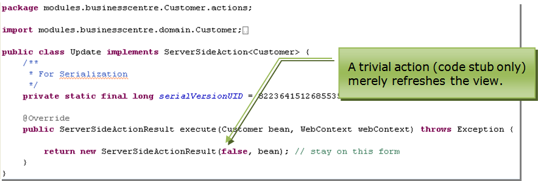

## Actions

Skyve offers the following action types:

  Action type | Description
  ----------- | -----------------------------------------------
  action      | a custom action created by the developer which implements org.skyve.metadata.controller.ServerSideAction
  add         | the implicit Skyve action to add a member to the dataGrid/collection (deprecated)
  cancel      | the implicit Skyve action to cancel editing of the current view
  defaults    | the collection of implicit Skyve actions - specific actions will be determined by user access privileges and context (for example whether zoomed in from a dataGrid or listGrid, or "pinned"/navigated to directly)
  delete      | the implicit Skyve action to delete a document instance (not relevant for a dataGrid/collection member, not relevant unless the user has _Delete_ privileges)
  download    | a special case of the custom action that extends org.skyve.metadata.controller.DownloadAction, capable of delivery of an artefact/files to the user
  import      | a special case of custom action using Skyve's bizport capability to import and process data
  export      | a special case of custom action using Skyve's bizport capability to export data
  new         | the implicit Skyve action to create a new document instance (not relevant for dataGrid/collection member, not relevant unless the user has _Create_ privileges)
  ok          | the implicit Skyve action to *Save and return* to the list context (not relevant unless the user has _Update_ privileges)
  print       | calls the Skyve report generator to layout the view as a report
  remove      | the implicit Skyve action to remove the current document instance from the collection (relevant for dataGrid/collections, not relevant unless the user has _Delete_ privileges)
  report      | run a report (for example using the Jasper report framework)
  save        | the implicit Skyve action to *save* the current document instance (not relevant unless the user has _Update_ privileges)
  upload      | a special case of custom action that extends org.skyve.metadata.controller.UploadAction, capable of receiving (and processing) a file uploaded by the user
  zoomOut     | the implicit Skyve action to return from a collection member to the bean that owns the collection (relevant for dataGrid/collection members, not relevant unless the user has _Update_ privileges)

*Implicit Actions* are actions which are provided by Skyve by default based on the context of the current user gesture. By default, a Skyve view will contain a default collection of Implicit actions.

In addition to implicit actions provided by Skyve, developers can create Custom actions, or override Implicit action behaviour in the document *Bizlet*.

If no view has been declared for a document, Skyve will include all actions the user has access to (declared via role permissions) in the default view. When a view declaration is supplied, the view declaration will control visibility and other properties of the action button.

Action classes are located within the actions folder in a document package and correlate to action buttons in the user interface. All actions implementing *ServerSideAction* cause the view to be re-rendered.



To create a new action behaviour:
* create an action class in the *actions* package within the document package
* declare the action in the *<actions/>* section of the view declaration
* set permissions to execute the action within the role definitions section of the *module.xml* file.

Note that actions can also be triggered by declaring *onChangeHandlers* for a specific widget in a view.

When a view declaration is supplied, the action must be declared in the
*actions* section of the *view.xml*.

```xml
  <actions>
    <action displayName="PreviousPeriod" className="PreviousPeriod" inActionPanel="true" />
    <action displayName="NextPeriod" className="NextPeriod" inActionPanel="true" />
    <action displayName="Calculate" className="Calculate" inActionPanel="true" />
    <action displayName="Update" className="Update" inActionPanel="false" />
  </actions>
</view>
```

_Example action section of a view definition_

The action element of the view definition indicates the *className* of
the action as well as the *displayName* (button text). Action properties
are explained in full in the previous chapter.

Note that the action section of a view definition may also include implicit
actions, for example, with the `<defaults/>` tag.

```java
/**
 * Standardise the contact on press of Save button.
 */
@Override
public Contact preExecute(ImplicitActionName actionName, Contact bean, WebContext webContext) throws Exception {
  if(ImplicitActionName.Save.equals(actionName)) {
    AdminUtil.standardiseContact(bean);
  }

  return bean;
}
```

_Example customisation of the Save implicit action_

In the above example, the *Implicit* action *Save* (i.e. when the user
presses the *Save* button) is customised to determine and set the state
of the *eligibility* attribute. This code will be executed prior to the
usual *Implicit Save* behaviour.

Note that the behaviour above is initiated by the use of the Save button
in the view, and this is a separate event to the bean's _preSave_ lifecycle event.

OnChange events can trigger custom actions using the `<server/>` tag.
 
```xml
<combo binding="orgName" disabled="locked">
	<onChangedHandlers>
		<server action="UpdateModule" />
	</onChangedHandlers>
</combo>
```

_Example: the combo for *orgName* will call the custom action *UpdateModule* when changed_


**[⬆ back to top](#actions)**

---
**Next [Reports](./../_pages/reports.md)**  
**Previous [Views](./../_pages/views.md)**
