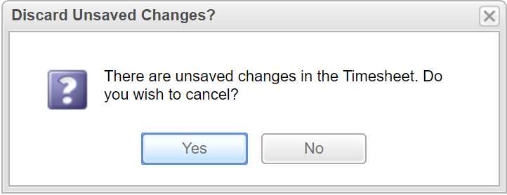
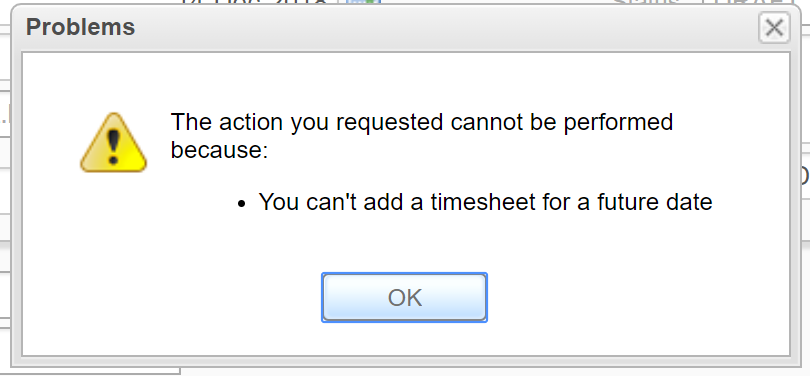
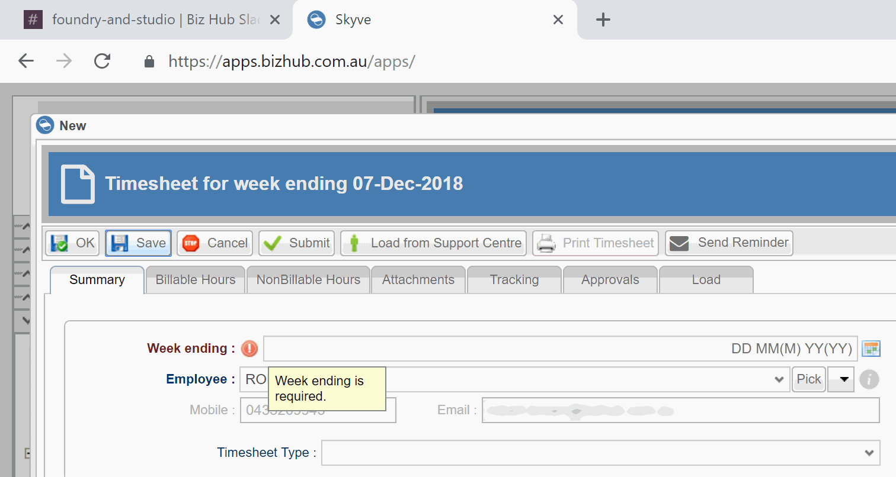

## Bizlets

A *Bizlet* is a class related to a document which extends default bean
behaviours and extends org.skyve.metadata.model.document.Bizlet

*Bizlets* can reference other classes without restriction and may be the
point of connection to highly specific application code.

The intention of the *Bizlet* is to contain only code relevant and
contextualised to a specific document, and so *Bizlet* classes are
located within the document package. Cross-document code or module-level
code should be included in a class created at the module level or
higher.


Bizlet classes only contain the minimum required code and methods, e.g.
only the necessary overrides. No code is required (in fact no Bizlet
class is required) for generic or default behaviour.

A Bizlet class may override bean-lifecycle methods.


### Lifecycle

Lifecycle event timing is as follows:

#### Bean level lifecycle

  Event | Description
  ----- | -----------
  newInstance() | called after instantiation through the *document.newInstance()*<br><br>The *newInstance()* method is commonly overridden to set application default values for the document.<br><br>If an exception occurs the bean will not be instantiated.
  postLoad() | called after instantiation and population of data store values<br><br>The *postLoad()* method can be called to recalculate values which are visible in a document list or detail view.<br><br>If an exception occurs, the associated view will open with an error dialog.
  preSave() | called before flushing the values to the data store or User press of \[Save\] button (before document validation)<br><br>The *preSave()* method can be overridden to ensure application rules or calculated fields are up to date before the bean is persisted.<br><br>If an exception occurs at this stage, the transaction will roll back and the change will not be saved.
  validate() | called after *preSave()* (and after document validation) but before flushing the values to the data store<br><br>The *validate()* method is commonly overridden to include additional complex document validation (other than implicit validation of requiredness etc.).<br><br>If an exception occurs at this stage, the transaction will roll back and changes will not be saved.
  postSave() | called after flushing values to the data store and after all integrity and validation checks have been performed<br><br>The *postSave()* method might be overridden to perform an action only on a successful save of the bean, e.g. to send a confirmation email.<br><br>If an exception occurs at this stage, the transaction will roll back and changes will not be saved.
  preDelete() | called before deletion from the data store<br><br>The *preDelete()* method might be overridden to perform a logical check that the record can be deleted, according to rules which cannot be enforced by a simple constraint.<br><br>If an exception occurs at this stage, the transaction will roll back and the data will not be deleted.

#### User interface level lifecycle

  Event | Description
  ----- | -----------
  getConstantDomainValues() | called when rendering the pertinent field (including in list view) - Constant domain values may be baked into the view and remain invariant for the system life. 
  getVariantDomainValues() | called when rendering the pertinent field (including in list view) - Variant domain values are guaranteed to be evaluated each request-response cycle.
  getDynamicDomainValues() | called when rendering the pertinent field (including in list view) - Dynamic domain values are guaranteed to be evaluated as for variant values, except that the bean is provided to the method for value generation.
  preExecute() | called before an implicit action is executed
  preRerender() | called before the rerender action is executed (immediately before a view is re-rendered after another action)

### Implicit actions

Skyve provides a number of implicit actions which do not require
developer code.

In each case overriding the *preExecute*() method for an
*ImplicitActionName* gives the developer the opportunity to add business
logic in anticipation of each action type.

The *ImplicitActionName* is an enumeration of Skyve actions.

Implicit Action | Definition
----------------|-----------
Defaults | Produce default button for the view type
Ok | OK on edit view
Save | Save on edit view
Delete | Delete on edit view
Add | Add on child edit view
ZoomOut | Change on child edit view
Cancel | Cancel on edit view and child edit view
Remove | Remove on child edit view
New |  Add new item from a list view
Edit | Edit an item from a list view
Report | Fire up a report dialog from a button
Navigate |Navigate to a binding within a conversation
Import | Import data using the BizPort capability
Export | Export data using the BizPort capability
Download | Create and stream a file for Download
Upload | Upload and process a file
Print |	Prints the current view

#### preExecute() versus preSave()

Using the _preExecute()_ method provides a level of control to the developer
to perform specific code only when the user initiates an action, as opposed to 
the code being performed as part of the bean lifecycle.

For example, if code is added to the _preSave()_ method, the code will be performed
every time the bean is persisted, whether as the result of a user interaction, a job, or as the result of cascading saves within the context of another document.

Using the _preExecute(ImplicitActionName.Save)_ however will only execute when the user
initiates the _Save_ action (presses the _Save_ button in the view). Note - this will not include 
the use of the _OK_ action. 

The following example shows a common use of _preExecute()_ using the _Save_ and _OK_ implicit actions
so that the code is executed when the user either presses _Save_ or _Ok_ since both will result in
the instance being persisted.

```java
@Override
public Configuration preExecute(ImplicitActionName actionName, Configuration bean, Bean parentBean, WebContext webContext) 
		throws Exception {
	
	if(ImplicitActionName.Save.equals(actionName) || ImplicitActionName.OK.equals(actionName)) {
		if(bean.getUserSelfRegistrationGroup()==null) {
			bean.setAllowUserSelfRegistration(Boolean.FALSE);
		}
	}
	
	return super.preExecute(actionName, bean, parentBean, webContext);
}
```	

#### Tracing Bizlet callbacks

To assist developers to understand the implications of event code, you can turn on tracing of Bizlet callback in the project json settings.

```json
// bizlet callbacks
bizlet: true,
```

With this option set, Skyve will trace out all Bizlet callbacks to the Wildfly `server.log` file.

#### Dirty tracking - _isChanged()_ and _originalValues()_

Skyve tracks whether a bean has been changed, and what attributes have been modified, within the current conversation context, until the bean saved or otherwise reset.

When a bean property is set (using the setter), the attribute binding name will be added to the bean.originalValues() map and `bean.isChanged()` will return *true*. 

You can manually clear the `bean.originalValues()` map to reset `bean.isChanged()`.

```java
//starting from a clean bean
Util.Logger.info(bean.isChanged()); //returns false
bean.setMyValue("Hello");
Util.Logger.info(bean.isChanged()); //returns true
for(String s: bean.originalValues().keySet()) {
	Util.Logger.info(s + " - " +  bean.originalValues().get(s));
}
//returns myValue - <whatever the original value of myValue was>
bean.originalValues().clear();
Util.Logger.info(bean.isChanged()); //returns false
```

If `bean.isChanged()` returns true when the user presses _Cancel_, they will be prompted accordingly:


This can be useful for example when you are preparing transient values for a user view - you want to manipulate values, but you don't want the user to be prompted to save their changes if they _Cancel_.

#### Tracing dirty

To assist developers, you can turn on tracing of bean mutations in the project json settings.

```json
// mutations in domain objects
dirty: true
```

With this option set, Skyve will trace out all bean mutations to the Wildfly `server.log` file.

### Overriding the validate() method

Validation is a bean lifecycle event handled automatically by Skyve according to the metadata declaration, including:
* whether a user has privileges to _Create_, _Update_, _Read_ or _Delete_ the record
* whether a value for an attribute is _Required_
* whether a value is of the correct type
* whether a value is formatted correctly, or meets appropriate standard validations
* whether a record will violate uniqueness constraints

Developers may need to override the _validate()_ lifecycle event to provide additional clarity, or implement bespoke validation. The _validate()_ method supplies the bean and a ValidationException object.

```java
@Override
public void validate(WeeklyTimesheetExtension bean, ValidationException e) throws Exception {

	//don't allow timesheet to be submitted for a future date
	DateOnly today = new DateOnly();
	if(bean.getWeekEndingDate().after(today)) {
		e.getMessages().add(new Message("You can't add a timesheet for a future weekending date"));
	}
	
	super.validate(bean, e);
}
```	

In the above example, if the validation fails, the user will be prompted with a modal dialog containing the message as supplied, because the *Message* was created without a binding. 

 

Supplying a binding to the *Message* will direct the user to the attribute which requires attention. 

```java
@Override
public void validate(WeeklyTimesheetExtension bean, ValidationException e) throws Exception {

	//don't allow timesheet to be submitted for a future date
	DateOnly today = new DateOnly();
	if(bean.getWeekEndingDate().after(today)) {
		Message msg = new Message(WeeklyTimesheet.weekEndingDatePropertyName, "You can't add a timesheet for a future weekending date");
		e.getMessages().add(msg);
	}
	
	super.validate(bean, e);
}
```

Adding the attribute binding to the message yields context-sensitive indications in the view.


Note that when supplying the binding name we use the static constant property name for the attribute binding name `WeeklyTimesheet.weekEndingDatePropertyName` - this is to ensure consistency and so that if this attribute is renamed during a refactor, we can rely on the compiler to ensure we also update it here.

We recommend utilising the metadata directly - to retrieve specific names - e.g. for the singular alias of _"timesheet"_ and the displayname for the *weekending* attribute, as follows:

```java
@Override
public void validate(WeeklyTimesheetExtension bean, ValidationException e) throws Exception {

	//don't allow timesheet to be submitted for a future date
	DateOnly today = new DateOnly();
	if(bean.getWeekEndingDate().after(today)) {
		
		Customer customer = CORE.getCustomer();
		Module module = customer.getModule(WeeklyTimesheet.MODULE_NAME);
		Document document = module.getDocument(customer, WeeklyTimesheet.DOCUMENT_NAME);
		
		StringBuilder sb = new StringBuilder();
		sb.append("You can't add a ").append(document.getSingularAlias());
		sb.append(" for a future ").append(document.getAttribute(WeeklyTimesheet.weekEndingDatePropertyName).getDisplayName());
		sb.append(" date.");
		
		Message msg = new Message(WeeklyTimesheet.weekEndingDatePropertyName, sb.toString());
		e.getMessages().add(msg);
	}
	
	super.validate(bean, e);
}
```

The advantage of this approach is that application metadata display values can be modified without breaking developer code.

To provide a value-specific message, access the bean value directly:
```java
	sb.append("You can't add a ").append(document.getSingularAlias());
	sb.append(" for the future ").append(document.getAttribute(WeeklyTimesheet.weekEndingDatePropertyName).getDisplayName());
	sb.append(" date");
	sb.append(bean.getWeekEndingDate());
```

Or use the Binder.formatMessage() message as follows:
```java
	sb.append("You can't add a ").append(document.getSingularAlias());
	sb.append(" for the future ").append(document.getAttribute(WeeklyTimesheet.weekEndingDatePropertyName).getDisplayName());
	sb.append(Binder.formatMessage(customer, " date {" + WeeklyTimesheet.weekEndingDatePropertyName + "}", bean));
```	

To read more about the Binder utility class, see [Utility Classes](./../_pages/utility_classes.md "Utility Classes"). 

## Extension classes

Skyve allows for extension of the automatically generated domain classes for each document, 
enabling developers to extend default skyve code generation.

Extension classes can be used for domain-specific business logic to override and further enrich 
the domain model provided by Skyve (see anaemic versus rich domain models).

```java
public class ControlPanelExtension extends ControlPanel {

	public void trapException(Exception e) {
		StringWriter sw = new StringWriter(512);
		PrintWriter pw = new PrintWriter(sw);
		e.printStackTrace(pw);
		setResults(sw.toString());
	}
	
	/**
	 * Overriden to escape {, < & >.
	 * Add a new line out the front to line up all lines to the left of the blurb.
	 */
	@Override
	public void setResults(String results) {
		if (results == null) {
			super.setResults(null);
		}
		else {
			super.setResults('\n' + results.replace("{", "\\{").replace("<", "&lt;").replace(">", "&gt;"));
		}
	}
	
	@Override
	public Boolean getBizletTrace() {
		return Boolean.valueOf(UtilImpl.BIZLET_TRACE);
	}
```
<figure>
  <figcaption>Example of convenience and overridden methods in an Extension class</figcaption>
</figure>

Domain generation uses the extension class (if it exists).

By convention, the extension class for a document is located within the document package and 
named corresponding to the document, for example:


### Preparing values for display

Where values need to be prepared or modified for display, there are a number of options about how to proceed that further clarify the distinction between domain events, Bizlet overrides and Extensions classes.

#### Default values example

To set a default value for an attribute (rather than null) when the bean is created you can set the default value when declaring the attribute:
```xml
	<decimal5 name="totalBillableHours">
		<displayName>Total Billable (Hours)</displayName>
		<defaultValue>0</defaultValue>
		<converterName>Decimal5TimeDuration</converterName>
	</decimal5>
```		

The generated domain class (created by calling the *GenerateDomain* target) will construct an appropriately typed value as follows:
```java
	/**
	 * Total Billable (Hours)
	 **/
	private Decimal5 totalBillableHours = new Decimal5("0");
```

Alternatively, override the _newInstance()_ method in the Bizlet:
```java
@Override
public WeeklyTimesheetExtension newInstance(WeeklyTimesheetExtension bean) throws Exception {

	bean.setTotalBillableHours(new Decimal5("0"));
	
	return super.newInstance(bean);
}
```	

A third option may be useful if the value only needs to be set when the user creates a new record from the UI, by overriding the _New_ ImplicitAction as follows:

```java
@Override
public WeeklyTimesheetExtension preExecute(ImplicitActionName actionName, WeeklyTimesheetExtension bean, Bean parentBean,
		WebContext webContext)
		throws Exception {

	if (ImplicitActionName.New.equals(actionName)) {
			bean.setTotalBillableHours(new Decimal5("0"));
	}
``` 

Note that for this situation, the bean will be marked as *dirty* (as happens whenever the setter is used) and so if the user was to _Cancel_ they would be prompted about saving their changes.

You can avoid this prompt (if appropriate) by clearing the _bean.originalValues()_ map as follows:
```java
	if (ImplicitActionName.New.equals(actionName)) {
			bean.setTotalBillableHours(new Decimal5("0"));
	}
	
	bean.originalValues().clear();
```

We suggest for literal values, using the *<defaultValue>* method is preferred because it both more clearly describes the domain concept and also means less developer code to manage.

#### Calculated value example

You can override the _postLoad()_ Bizlet method to change attribute values after the bean is retrieved from the persistent store/database.

For example, if you needed to show how overdue a timesheet was (in the approval process), it would make sense to include a _transient_ attribute (i.e. not saved in the database) since this is constantly changing.

```xml
<integer name="overdueDays" persistent="false">
	<displayName>Overdue Days</displayName>
	<description>How many days overdue this timesheet is</description>
</integer>
```		

To ensure that the overdueDays above is always calculated whenever the bean is retrieved from persistence, you would override the _postLoad_ method as follows:

```java
@Override
public void postLoad(WeeklyTimesheetExtension bean) throws Exception {
	
	if(Status.dRAFT.equals(bean.getStatus())) {
		Integer overdueDays = TimeUtil.numberOfDaysBetween(bean.getWeekEndingDate(), new DateOnly());
		bean.setOverdueDays(overdueDays);
	}
	
	super.postLoad(bean);
}
```

However, you should note that _postLoad()_ will be called every time the bean is retrieved - by any mechanism or relationship - rather than (for example) only when the user views the value. This can be useful for displaying a value in a list of results.

An alternative approach could be to utilise the _preExecute_ and only calculate the value prior to the ImplicitActionName.Edit event (i.e. when the user zooms into the detail/edit view of the record).

```java
@Override
public WeeklyTimesheetExtension preExecute(ImplicitActionName actionName, WeeklyTimesheetExtension bean, Bean parentBean,
		WebContext webContext)
		throws Exception {

	if (ImplicitActionName.Edit.equals(actionName) || ImplicitActionName.New.equals(actionName)) {

		if(Status.dRAFT.equals(bean.getStatus())) {
			Integer overdueDays = TimeUtil.numberOfDaysBetween(bean.getWeekEndingDate(), new DateOnly());
			bean.setOverdueDays(overdueDays);
		}
	}
```

In the above example, the _overdueDays_ will be calculated if the user creates a new bean via the UI (for example by pressing  from the list), or zooms into the bean edit view.

Once again, because the setter for _overdueDays_ is called, the bean will be marked as *dirty*.

An alternative method is to override the getter for _overdueDays_ in the Extension class, as follows:

```java
@Override
public Integer getOverdueDays() {
	
	if(Status.dRAFT.equals(getStatus())) {
		Integer overdueDays = TimeUtil.numberOfDaysBetween(getWeekEndingDate(), new DateOnly());
		return overdueDays;
	} else {
		return null;
	}
}
```

In this situation (i.e. unless there are extenuating circumstances), overriding the getter in the Extension class is the preferred method, because:
* the bean is not marked as *dirty* (because the setter is not called)
* the _overdueDays_ will be recalculated whenever it is viewed or used in subsequent calculation 


**[⬆ back to top](#bizlets)**

---
**Next [Views](./../_pages/views.md)**  
**Previous [Internationalisation](./../_pages/internationalisation.md)**
