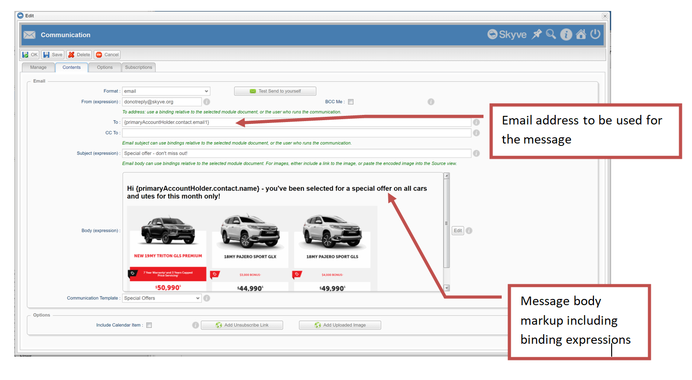
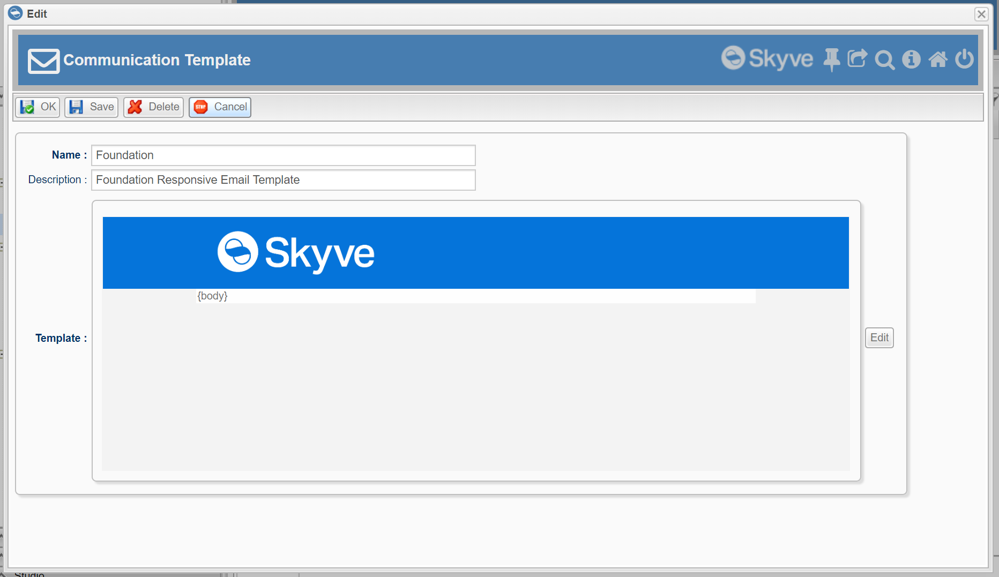
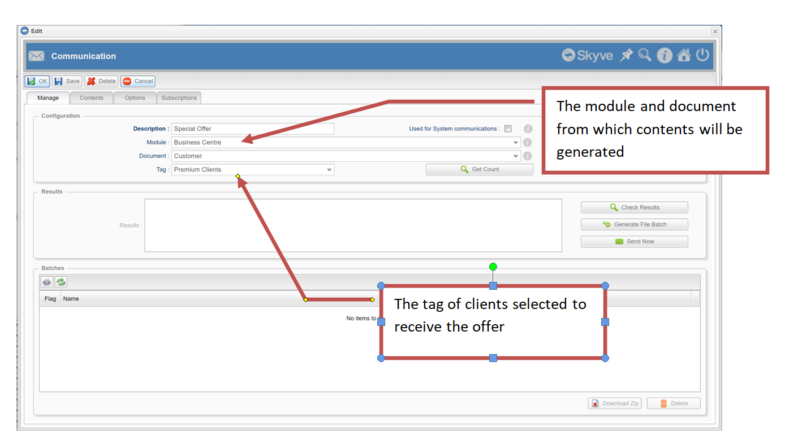

## Communication

Detailed instructions to send email messages from within a Skyve application are provided in the <a href="https://skyvers.github.io/skyve-user-guide/communication/">Skyve User Guide</a>.

The Skyve platform provides a framework for automated and bulk communication, both for user-initiated communications, and for automated communications (initiated in code). The *Communication* concept is designed to support the design of styling and layout by non-developers even where the the communication is sent by coded or automatic mechanisms. The communication concept is intended to support a variety of communication protocols, with email provided in the open-source distribution.

Skyve communication has built in support for user-definable templates, data bindings, attachments (including stored content items and reports), calendar items and subscription management.

For bulk communications, Skyve takes advantage of the *Tag* feature - a flexible way to select which records are used as the basis of the bulk communication (for example, which system users should receive the email, or which invoices should be sent).

The Skyve communication framework can send communications immediately via SMTP, or generate the messages as a batch of `.eml` format files for review and managed sending. 

The `CommunicationUtil` class provides a variety of methods for code-initiated automated communications and the inclusion of attachment items.

### Skyve Communication

The Skyve admin module provides the *Communication* and *Communication Template* menu items.


A *Communication* is the definition of a message and how it is bound to application data. The *Communication Template* contains generic header and footer details for communications - to enable consistent styling - while the *Communication* contains the binding expressions, body contents and other aspects of the specific message.



For example, a timesheet application may be required to notify a manager when an employee submits a timesheet. The developer creates a *Communication* called "Timesheet submitted" that provides the subject and body text for an email notification, with binding expressions to substitute for the employee details and the date of the timesheet. The *Communication* may also include attachments derived from the employee details or the timesheet record. For bound data from the timesheet or employee details, the *Communication* must specify the relevant *module* and *document* so that binding expressions can be resolved.

In this example, the communication will be generated via developer code when the timesheet is first saved with the *Status* set to *Submitted*.

Alternatively, an organisation may wish to send a number of clients an email regarding a special offer. Users (at runtime) may select which clients are to receive use the "Special offer" *Communication* that will include a PDF brochure as an attachment and a link to allow clients to *unsubscribe* to avoid receiving similar communications in the future.

In this second example, the user may manually initiate the sending step once reviews and checks are complete. The generation of outgoing messages will be managed by a *Job* which will in turn notify the user once all messages have been generated.

### Communication Template

Detailed instructions for creating a *Communication Template* are available from the <a href="https://skyvers.github.io/skyve-user-guide/communication-templates/">Skyve User Guide</a>.

Using a *Communication Template* is optional - if no template is specified on the communication, the message will simply display the body contents as specified in the *Communication* body text markup field.

If a *Communication Template* is specified, the template must contain the `{body}` tag to identify where the body contents of communication will be located within the generic header/footer layout.

You can create any number of *Communication Template*s with each *Communication* specifying the template on which it is based.



### Communication management

Detailed instructions to send email messages from within a Skyve application are provided in the <a href="https://skyvers.github.io/skyve-user-guide/communication/">Skyve User Guide</a>.

To initiate communications at run-time, the user must specify a *module* and *document* and a *Tag* that contains the specific instances from which the messages will be generated.



The management tab (pictured above) provides a number of management actions:

Action | Description
-------|------------
Get Count | return a count of the number of tagged records (which will correspond to the number of messages to be created
Check Results | run a Job to substitute every tagged record and validate whether the binding expressions provided in the *Communication* contents can be validly substituted
Generate File Batch | run a Job to generate email messages as `.eml` files into a batch folder (which can then be zipped for download)
Send Now | run a Job to immediately send all generated email messages.

If communications are marked as *Used for system communications*, deleting the *Communication* is blocked as are changes to the description, module and document settings. (To re-enable these, the *Communication* must first be saved with the system communications setting turned off.)

The contents tab allows the user to specify the message subject & body.


### CommunicationUtil

The `CommunicationUtil` class provides a number of convenience methods for initialising, generating and sending email communications as well as special expressions.

Enumeration | Description
------------|------------
ResponseMode | (*SILENT*, *EXPLICIT*) - whether the runtime user will be notified should an attempt to action a communication (i.e. test, send or generate) fails. If *SILENT* is set, failures will be logged. If *EXPLICIT* is set, exceptions will be thrown and success will be notified by a growl (provided a valid webContext is supplied).
RunMode | (*ACTION*,*TEST*) - For *TEST* the email binding expressions substitutions will be attempted. For *ACTION* messages will be generated or sent (as per the `ActionType`.
ActionType | (*FILE*,*SMTP*) - Whether to generate `.eml` files or to send the messages.

The replacement of binding expressions in the email is based on the `Binder.formatMessage()` method (see [Utility classes](./../_pages/utility-classes.md)), however the `CommunicationUtil` class provides additional expressions that can be included in binding expressions.

Expression | Description
-----------|-------------
`{#url}` | the url for the bean - useful for including a link to the subject bean in the body of the message
`{#context}` | the application context - useful for including a link to the application in the body of the message

#### Sending a simple bean-based communication

`CommunicationUtil.sendSimpleBeanCommunication()` provides a basic convenience method to send a communication from code for a bean (or beans) using binding expressions.

An example method call is provided:

```java
CommunicationUtil.sendSimpleBeanCommunication(
	ModulesUtil.currentAdminUser().getContact().getEmail1(),
	"Notification Failure", 
	"Notification failed for bean {#url}", 
	ResponseMode.SILENT, 
	FormatType.email, 
	bean);
```

Using this method, the Communication is not saved for re-use and the method will attempt to send the email immediately.

#### Initialising a communication from code

Because developers create application code before Production data exists, Skyve provides a fail-safe way to initialising a communication record so that methods which send automated communications can be relied upon to succeed (providing configuration of the Production system is valid).

The `CommunicationUtil.sendFailSafeCommunication()` will check if a communication exists and if not, create and safe the communication before using that communication to send the message.

```java
// send invitation email
CommunicationUtil.sendFailSafeSystemCommunication(
	UserListUtil.SYSTEM_USER_INVITATION,
	UserListUtil.SYSTEM_USER_INVITATION_DEFAULT_SUBJECT,
	UserListUtil.SYSTEM_USER_INVITATION_DEFAULT_BODY,
	CommunicationUtil.ResponseMode.EXPLICIT, 
	null, 
	newUser);
``` 

If a communication of the same name has been created prior to the method being called, (and for example styled by a graphic designer), then the existing communication will be used for the method call.

**[⬆ back to top](#communication)**

---
**Next [Maven targets](./../_pages/maven-targets.md)**  
**Previous [Working with geometries and geospatial](./../_pages/geospatial.md)**
