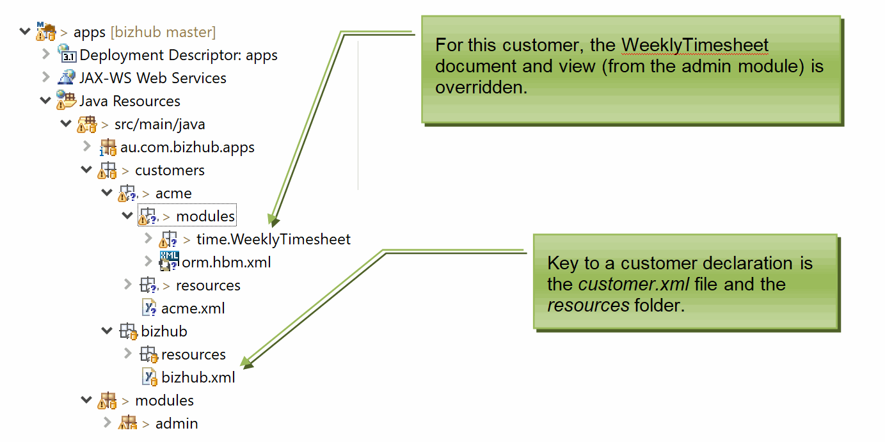
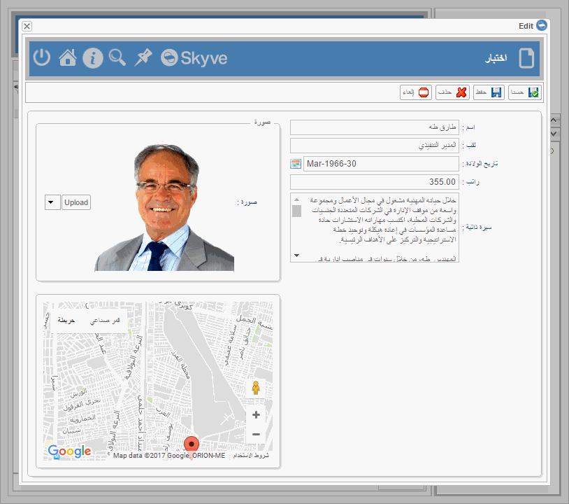
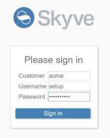

## Customers

### Customer declaration
Skyve supports multi-tenant Software-As-A-Service (SAAS) applications
with extensive ability to customise the application for each
tenant/customer.

Each customer's experience of the application is declared within the
customer package. The customer package includes a `customer.xml`
manifest file and a resources folder.

By convention, developers are encouraged to locate all
application-specific artefacts (such as project management and reference
materials) within the customer package.



The `customer.xml` file declares which modules the customer has access
to, which default converters to use, the location of key resources, and
the default (or home) module.


The `customer.xml` file must declare the customer name. The customer
name is used to differentiate ownership of data rows within the database
(and therefore also users at the default login page).

The `customer.xml` file also declares the location of the customer logo
file (displayed in the top left hand corner of the UI above the
accordion pane), and assumes the file is located within the customer's
resources folder.

#### Internationalisation
Skyve supports building apps for local language support and multi-language support (internationalisation) and both left-to-right and right-to-left languages.



To set a default language for a customer, include the language property in the customer.xml declaration as follows. 

```xml
<?xml version="1.0" encoding="UTF-8" standalone="yes"?>
<customer name="projecta"
            xmlns="http://www.skyve.org/xml/customer"
            xsi:schemaLocation="http://www.skyve.org/xml/customer ../../schemas/customer.xsd"
            xmlns:xsi="http://www.w3.org/2001/XMLSchema-instance"
            language="ar">
</customer>
```

If the language (in this case "ar") is not specified in the `customer.xml`, Skyve will detect the language set in the browser, provided there is a matching internationalisation file.


For more details, see [Internationalisation](./../_pages/internationalisation.md)

### Resources

Skyve provides a resource hierarchy to allow for the inclusion of
additional resources in a generic way.

Throughout the application, resources (like the *relativeIconFileName*
for actions) resolve the applicable resource location from the resources
hierarchy.

Resources (e.g. button icon files) can be defined for each module within
the module *resources* folder. Resources can also be defined per
customer within the customer *resources* folder (e.g. the company logo
file).

A module *resources* folder can be overridden as part of a customer's
module override by placing files of the same name as occur in the
original module.

So that report templates can references resources in a generic way, the
absolute file location of the customer resources folder is resolved at
run-time and included automatically as a report parameter.

### Modules

The `customer.xml` file lists all modules accessible to the customer.

The order of modules listed in the `customer.xml` file is the order that
module-level accordion menus appear in the accordion pane. Additionally,
the order of modules defines the compile order. If developers create
cross-module code, the compile order must be considered for that
customer.

The home or default module is declared here but can be overridden per
user from within the user functionality (within the admin module).

### Adding a new customer

Skyve is designed around the ability to build applications, then re-sell them to multiple _customers_ or _tennants_ as Software-as-a-Service (SaaS). 
The _customer_ concept allows you to share and reuse the code you create for your application, 
and customise it for each _customer_ (where appropriate).

In a multi-tenanted environment, each user must specify the customer scope in which their account exists.



In Skyve the term _Customer_ connotes customisation. If there's no (or only trivial) customisation required,
 you might resell the software to millions of users under the one Skyve customer context.

### Setting a default customer

Note that if you only ever want to use a single customer, you can specify a default customer in the .json file of your instance. This will also avoid having to enter a customer name at the sign in prompt.

1. Edit the file '.json' instance settings file (in the `wildfly/standalone/deployments/` folder)
2. Search for the ```// Customer Default``` comment
3. Change the default customer setting from null to your customer name, for example changing ```customer: null,``` to ```customer: "acme",```
4. Save the file and restart your wildfly server (or redeploy the application by renaming ```myApplication.war.deployed``` to ```myApplication.war.dodeploy```.


### Customer roles

For background on the security group concept, see [Security groups](./../_pages/building-applications.md).

The customer declaration may include customer roles - named combinations of module roles into coherent usage profiles.

Security groups are created at runtime by users with the role `admin.SecurityAdministator`. If the option `<roles allowModuleRoles="true">` then administrators will be able to mix their own combinations of roles from those declared in each module. If this option is set to `false` then only the declared customer roles will be available through the user interface.

An example customer declaration with customer roles is as follows:

```xml
<?xml version="1.0" encoding="UTF-8" standalone="yes"?>
<customer name="myClient" xmlns="http://www.skyve.org/xml/customer"
	xsi:schemaLocation="http://www.skyve.org/xml/customer ../../schemas/customer.xsd"
	xmlns:xsi="http://www.w3.org/2001/XMLSchema-instance">
	<uiResources logo="client_logo.png" />
	<defaultDateConverter>DD_MM_YYYY</defaultDateConverter>
	<defaultTimeConverter>HH24_MI</defaultTimeConverter>
	<defaultDateTimeConverter>DD_MM_YYYY_HH24_MI</defaultDateTimeConverter>
	<defaultTimestampConverter>DD_MM_YYYY_HH24_MI_SS</defaultTimestampConverter>
	<modules homeModule="tasks">
		<module name="admin" />
		<module name="tasks" />
		<module name="projects" />
	</modules>
	<roles allowModuleRoles="false">
		<role name="Basic User">
			<description>Basic access to the system to log in and maintain own settings.</description>
			<roles>
				<role module="admin" name="BasicUser" />
			</roles>
		</role>
		<role name="External Client access">
			<description>Basic role for all external users</description>
			<roles>
				<role module="admin" name="AppUser" />
				<role module="tasks" name="ExternalTask" />
			</roles>
		</role>
		<role name="Internal client manager">
			<description>Access to create and maintain JAGS applications and claims</description>
			<roles>
				<role module="admin" name="SecurityAdministrator" />
				<role module="tasks" name="Task Manager" />
				<role module="projects" name="Project Manager" />
			</roles>
		</role>
	</roles>
	<interceptors/>
</customer>
```	

In the above example, the option `<roles allowModuleRoles="false">` means that only the roles declared above can be selected at runtime.  

**[⬆ back to top](#customers)**

---
**Next [Modules](./../_pages/modules.md)**  
**Previous [Building Applications](./../_pages/building-applications.md)**
