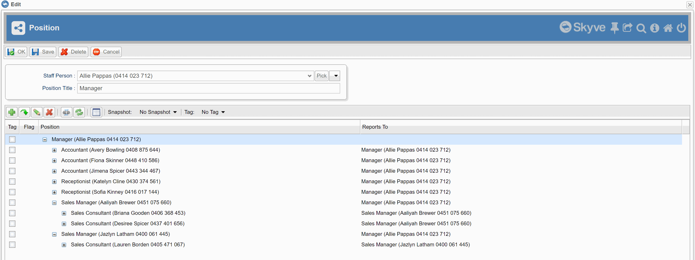

## Hierarchies

Skyve provides support for n-level hierarchy structures such as organisation structures, work break-down structures, inventory structures, bills of material and other tree structures.

The *desktop* mode renderer includes a lazy-load tree viewer that enables user exploration and navigation. As the user expands nodes, the child nodes are loaded, enabling support of large complex structures.

### Declaring hierarchic structures

To declare a document to support hierarchic structures, set the `parentDocument` attribute of the document to be itself, i.e. the same document, for example, review the declaration of the following _Position_ document to represent an organisation structure:
 
```xml
<document name="Position" xmlns="http://www.skyve.org/xml/document" xsi:schemaLocation="http://www.skyve.org/xml/document ../../../schemas/document.xsd"
	xmlns:xsi="http://www.w3.org/2001/XMLSchema-instance">
	<documentation>
		<![CDATA[
			Staff position.
		]]>
	</documentation>
	<persistent name="WHO_Position" />
	<singularAlias>Position</singularAlias>
	<pluralAlias>Organisational Structure</pluralAlias>
	<iconStyleClass>fa fa-share-alt-square</iconStyleClass>
	<parentDocument>Position</parentDocument>
	<bizKey expression="{positionTitle} ({staff.contact.name} {staff.contact.mobile})"/>
	<attributes>
		<text name="positionTitle">
			<displayName>Position Title</displayName>
			<length>200</length>
		</text>
		<association type="aggregation" name="staff">
			<displayName>Staff Person</displayName>
			<documentName>Staff</documentName>
		</association>
	</attributes>
</document>		
```

In the above example, the "Position" document declares it's `parentDocument` as "Position". Each position node of the hierarchy has an association to a `Staff` document which has the specific employee details for each employee. 

To use the tree view widget in the *desktop* mode renderer, declare a `tree` menu item as follows:

```xml
<tree name="Organisation Structure" document="Position" >
	<role name="Manager" />
	<role name="StaffMember" />
</tree>
```  

The above declarations will yield the following tree viewer in the *desktop* mode renderer.


By default, Skyve will use the declared `bizKey` as the display item for each node in the structure.

Note that currently, a lazy-load hierarchic view widget is not available for *responsive* mode renders, and these will degrade to a simple list view of top-level nodes, as follows:


Zooming in from the tree view will display the detail view of the node.

### Context specific hierarchic display

Skyve provides the `treeGrid` widget for showing hierarchic/tree structures within a specific context. The `treeGrid` provides the parameter attribute `rootIdBinding` which will locate the `treeGrid` at the node corresponding to the binding supplied.

To utilise the treeGrid, you must specify a suitable query in the `module.xml`, for example:

```xml
<query name="qPosition" documentName="Position">
	<description>Organisation Structure</description>
	<columns>
		<column binding="bizKey" sortOrder="ascending"/>
	</columns>
</query>
```		

In the above query, the only column declared shows the bizKey for each node.

Once the query is declared, the `treeGrid` widget can be declared in the document view as follows:

```xml
<?xml version="1.0" encoding="UTF-8" standalone="yes"?>
<view title="Position" name="edit" xmlns="http://www.skyve.org/xml/view"
	xsi:schemaLocation="http://www.skyve.org/xml/view ../../../../schemas/view.xsd"
	xmlns:xsi="http://www.w3.org/2001/XMLSchema-instance">
	<form border="true" percentageWidth="50">
		<column percentageWidth="20" />
		<column />
		<row>
			<item>
				<default binding="staff" />
			</item>
		</row>
		<row>
			<item>
				<default binding="positionTitle" />
			</item>
		</row>
	</form>	
	<treeGrid continueConversation="true" rootIdBinding="bizId" query="qPositions" />
	<actions>
		<defaults />
	</actions>
	<newParameters />	
</view>
```

In the above example, the rootIdBinding is set to be the `id` of the node which is being viewed. This means that the `treeGrid` will show the tree and allow exploration _from the current node down_ only, i.e. the subordinate tree.



Note that the `treeGrid` provides the `continueConversation` parameter attribute to allow the developer to decide the transactional demarcation of changes the user may make when zooming into subordinate tree nodes.

**[⬆ back to top](#hierarchies)**

---
**Next [Reports](./../_pages/skyve-persistence-mechanisms.md)**  
**Previous [Views](./../_pages/maven-targets.md)**
