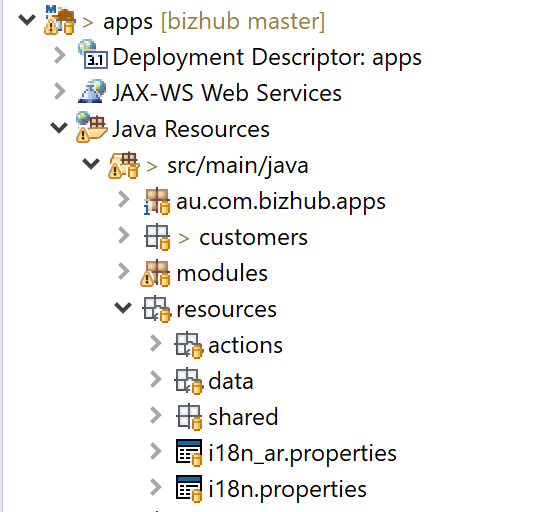

## Internationalisation and language support

Skyve supports UTF-8 characters in metadata declarations and for application data, provided the database chosen by the developer is configured correctly.

You can also build Skyve applications for multi-language/internationalisation using a traditional resource-file based approach.

Skyve provides a basic internationalisation resource file as a starting point for non-English usage. The file is named according to the ISO 639-1 two-letter language code in the `project/resources` folder.



The resource file contains key value pairs for the basic fixed Skyve messages, however you can expand these files for your own tokens (tokens you declare in your application metadata declaration).

### Setting a default language for a customer

Internationalisation and language support can also be specified when declaring the customer using the _language_ attribute
, and Skyve supports both left-to-right and right-to-left languages.


To set the default language for a customer, include the language setting as follows (in this example, "ar"=Arabic).

```xml
<?xml version="1.0" encoding="UTF-8" standalone="yes"?>
<customer name="projecta"
            xmlns="http://www.skyve.org/xml/customer"
            xsi:schemaLocation="http://www.skyve.org/xml/customer ../../schemas/customer.xsd"
            xmlns:xsi="http://www.w3.org/2001/XMLSchema-instance"
            language="ar">
</customer>
```

If the language is not specified in the `customer.xml`, Skyve will detect the locale set in the browser, provided there is a matching internationalisation resource file provided.


### UTF-8 Data

To ensure the database can store UTF-8 characters, ensure you have set the character set and collation.

For example, whereas H2 supports UTF-8 with default settings, for MySQL, ensure that the database is created with the correct character set and collation: 

```sql
CREATE DATABASE myDatabase CHARACTER SET utf8 COLLATE utf8_general_ci;
```

Additionally for MySQL, ensure your datasource connection string includes Unicode and UTF-8 encoding, for example:

``` 
jdbc:mysql://myServer:3306/myDatabase?useUnicode=true&amp;characterEncoding=UTF-8&amp;useCursorFetch=true&amp;defaultFetchSize=100
```

### Local language support

You can use UTF-8 characters for display attributes in Skyve metadata


### Building apps for multiple languages

To create an application which is available in more than one language, you can use the token-replacement feature to add tokens for the metadata declaration and matching key-value pairs in internationalisation resource files.

We suggest using the _module.document.attribute(.property)_ naming convention for your tokens, as shown.


**[⬆ back to top](#contents)**

---
**Next [Bizlets](./../_pages/bizlets.md)**  
**Previous [Converter, validator and format](./../_pages/converters.md)**