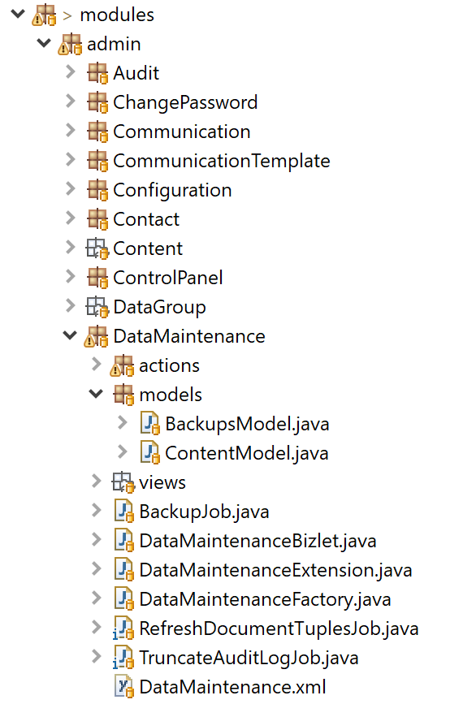

## Lists and models

The Skyve list capability is core to most Skyve applications, and while much of the behaviour is usually implicit (just presenting a list of bean tuples from the database), Skyve allows overriding and customisation of the feature.

This is particularly useful where a developer needs to drive a list or tree from non-database data, or to customise the way filtering or summary features work.

The `treeGrid` feature (see <a href="https://skyvers.github.io/skyve-dev-guide/hierarchies/">Hierarchies</a>) is a special case of the list feature, where a filter is applied to return only nodes with a designated parent (representing that part of the tree), and therefore treeGrids can be customised in the same way as `listGrid`s.

Some situations where a developer may want to consider customising the feature:
* showing a list of files or folders from the file system
* listing content items from the content repository
* driving tree grids to use non-database driven hierarchies
* querying a web API
* using a non-SQL datasource
* showing an email list from the SMTP server
* changing the way the `<filterParameter>` works for a `listGrid`

### Example reference list models

The Skyve admin module contains several use-cases of `ListModel` implementations which are useful for developers to review:

Model | Description
-------|---------
`DataMaintenance.BackupsModel` | lists items from the file system using the list feature 
`DataMaintenance.ContentModel` | lists items from the content repository using the list feature
`Communication.BatchesModel`  | *this is a basic variant of the DataMaintenance.BackupsModel*

### Declaring a list model

A list model is a Java class that extends `ListModel<>()` (or one of the subtypes) and is located in the models subpackage of the document package (as shown below):



Once the model is declared, it can be referenced using the `listGrid` widget in a view:

```xml
<listGrid model="BackupsModel" 
	selectedIdBinding="selectedBackupName" 
	continueConversation="false" 
	showAdd="false"
	showEdit="false" 
	showExport="false" 
	showFilter="false" 
	showRemove="false" 
	showSnap="false" 
	showSummary="false"
	showTag="false" 
	showZoom="false" 
	postRefresh="backupsRefreshRequired">
	<onSelectedHandlers>
		<server action="BackupSelected" />
	</onSelectedHandlers>
</listGrid>
```

In the above example, the `listGrid` uses the `BackupsModel` for basic display and selection of listed items (in this case, the backup files on the file system). 

`continueConversation` is set to false as `zoom` is not available. 

The `postRefresh` is controlled by the `backupsRefreshRequired` condition to avoid endless refreshing of the list as a result of the `onSelectedHandlers`. 

The `selectedIdBinding` is the binding name of the document attribute that will be updated when a row is selected - and used as the basis of code to handle the selected backup file.

#### Concepts

Skyve lists and models rely on a number of key concepts:

Concept | Description
--------|-----------
`Driving Document` | The primary document being listed - the document that will be navigated to if the user zooms into a row in the list
`Projection` | data fields returned or contained by the list concept, but not necessarily displayed as a column
`Column` | data fields which are shown to the user in the list
`Parameter` | a value and binding pair passed to the list - usually for the purposes of constructing a filter
`Filter` | a set of criteria limiting what data is returned by the list 
`Detail Query` | the way of retrieving the rows shown in the list
`Summary Query` | the way of retrieving the summary totals shown in the list summary
`Page` | a Class that represents a list of rows with a size and summary

#### Key methods

Method | Description
-------|------------
`fetch()` | returns a `Page` of results to be displayed in the `listGrid`
`iterate()` | enables export of a row using the export features of the `listGrid`

The general approach for creating a simple list model is:
* In the constructor, set the drivingDocument, projections and columns - this might be done for special cases of query-based models by specifying or establishing the query on which the list will be based
* Implement the `fetch()` method to return a `Page` of results for display.

#### Special case list models

ListModel | Description/comments
----------|--------------
`DocumentQueryListModel` | this approach takes advantage of the inbuilt handling of `DocumentQuery` and allows the developer to customise or construct the `DocumentQuery` and filters with minimal effort (rather than specifying the `DrivingDocument`, `Projections`, `Columns` and a `fetch()` method)
`InMemoryListModel` | intended to provide a basis for complete implementation of all listGrid functions - advanced filtering, tags, flags, snapshot, summary etc.

**[⬆ back to top](#lists-and-models)**

**Next [Maven targets](./../_pages/maven-targets.md)**  
**Previous [Communication](./../_pages/communication.md)**  
