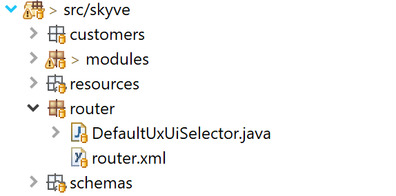
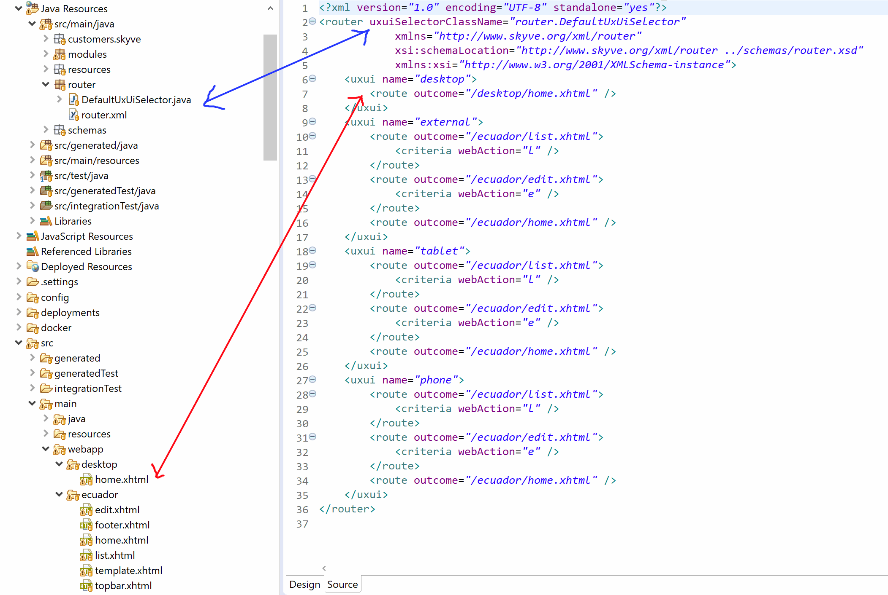
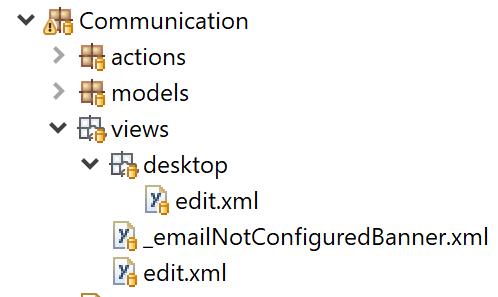
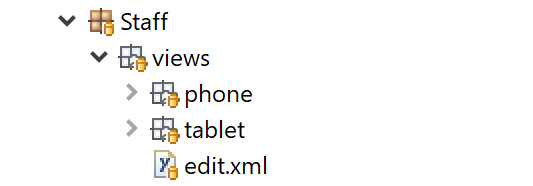
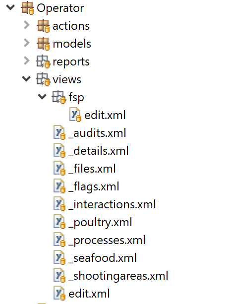

## Routing and rendering

Skyve provides flexible control of routing to allow developers to customise the rendered user experience depending on a range of user context factors including, device, customer and access vector (i.e. whether the user is accessing the system externally or internally). 

By default, Skyve applications will render appropriately for user agent types/device types (*desktop*, *phone*, *tablet*), but also allow the user to voluntarily switch modes between *desktop* and *default* rendering modes.

This behaviour is subject to the Skyve `router`, providing a centralised approach to managing which outcomes are served to the user and also allows developers to hijack the url and serve the user a traditionally templated page (for example using Faces/xhtml) in places of the usual Skyve result. This approach gives a level of sophisticated control over which outcomes are served to the user, while maximising re-use of code and metadata. 

Skyve applications are rendered according to the routing instructions provided in the application `router.xml` within the project `router` package as shown:



### How Skyve routing works

When a user accesses a Skyve application context ("/"), the request goes to the home.jsp through Java EE's welcome mechanism.

The home.jsp analyses the request to check if the request is a valid Skyve request, and whether a user session already exists. Once the request is validated, Skyve calls the UXUI selector class specified in the `router.xml`.

The selected UXUI result is then passed through the routing specified in the `router.xml` which directs where to forward the request, and the request is then forwarded using the servlet request dispatcher (this is a server-side forward rather than a browser re-direct).
 
The result of the routing may be to one of Skyve's archetypal web actions, or to a custom page created using traditional approaches (for example a JSF/xhtml page).

#### Skyve web actions

Skyve has 5 archetypal web actions that represent the Skyve concepts of user interactions - *edit* (for managing the details of application data), as well as 4 types of aggregated navigable interactions - *list*, *calendar*, *map* and *tree*. These archetypes are implemented as separate Faces (xhtml) template pages.

The Skyve router directs Skyve to route to one of these pages.

 

The `router.xml` declares routing outcomes for the following `webActions`:

Web Action | Code | Description
-----------|------|------------
calendar | *c* | a *temporal* representation of aggregate data, representing the corresponding date/time and duration
edit | *e* | a detail or edit view - that facilitates data entry and maintenance
list | *l* | aggregate data
map | *m* | a *spatial* representation of aggregate data, representing the physical location and boundary
tree | *t* | a *hierarchical* representation of aggregate data

### UXUI 

Skyve allows control over views and control access to menu items for specific UXUI (User eXperience-User Interface) outcomes.

Skyve provides 4 basic conceptual UXUIs, however developers can add to these if required.

The 4 default UXUI concepts are:

UXUI | Description
-----|-------------
*desktop* | not specifically designed for touch-screen input - perhaps with a mouse or touchpad - this includes common desktop and laptop devices
*phone* | a small mobile or wearable device with limited size and usually with touch-screen input
*tablet* | a device primarily driven by touch-screen input, but with a larger screen than a phone
*external* | a device detected as coming from a user who is external to the network or organisation - i.e. usually a member of the public or a client

Developers can customise how these are used within their application, how a UXUI result is selected for the user, and declare additional UXUIs if required. The Skyve metadata declaration responds to the UXUI selected, and menu items and views can be declared for specific UXUIs.

#### The DefaultUxUiSelector class

The `DefaultUxUiSelector` class is the default implementation of the `UxUiSelector` interface.

The class declares the UXUI result types (by default these are *desktop*, *tablet*, *phone* and *external*) and uses the UserAgentType and HTTPServletRequest to determine which UXUI is selected, prior to routing.

Developers can customise this class, or create their own (remembering to set the reference to their own class in the `router.xml`), to include their own UXUI results.

#### Understanding Skyve requests

The following are examples of valid Skyve requests for `myApplication` served via the domain `mydomain`.

Example 1 - edit view for module and document

`https://mydomain/myApplication/?a=e&m=invoice&d=InvoiceParameter`

 Fragment | Description/interpretation
 ---------|---------------------------
`a=e` | `a` (*webAction*) = `e` (*edit*)
`m=invoice` | the `m` (*module*) named `invoice`
`d=InvoiceParameter` | the `d` (*document*) named `InvoiceParameter`

Example 2 - list view for module and document 

 `https://mydomain/myApplication/?a=l&m=invoice&q=Invoice`

 Fragment | Description/interpretation
 ---------|---------------------------
`a=l` | `a` (*webAction*) = `l` (*list*)
`m=invoice` | the `m` (*module*) named `invoice`
`q=Invoice` | the `q` (*query*) named `Invoice` - in the case where there is no query named `Invoice`, Skyve will infer that this is the document name and attempt to resolve the default or implicit query for the document

Example 3 - list view for module and named query

 `https://mydomain/myApplication/?a=l&m=invoice&q=qAllInvoices`

 Fragment | Description/interpretation
 ---------|---------------------------
`a=l` | `a` (*webAction*) = `l` (*list*)
`m=invoice` | the `m` (*module*) named `invoice`
`q=qAllInvoices` | the `q` (*query*) named `qAllInvoices`

#### Routing criteria and outcomes

The `router.xml` specifies the outcomes for each UXUI based on criteria. Skyve provides for criteria based on the session and the request. The route outcomes are processed in the order specified in `router.xml`.
 
Criteria | Description
-----------|-----------
customer | route based on which *customer* the user account belongs
dataGroupId | route based on which *dataGroup* the user account belongs
document | route based on which document is specified in the request
module | route based on which module is specified in the request
query | route based on which Skyve query is specified in the request
userId | route based on the user account `id`
viewType | (either *create*/*edit* - the other types are now deprecated) - whether the route would usually result in the *create* or *edit* view
webAction | route based on which Skyve webAction is specified in the request

Example route for a *phone* UXUI:

```xml
<uxui name="phone">
	<route outcome="/whosinIntegrate/inout.xhtml">
		<criteria webAction="e" module="whosinIntegrate" document="Office" />
	</route>
	<route outcome="/whosinIntegrate/mystatus.xhtml">
		<criteria webAction="e" module="whosinIntegrate" document="MyStatus" />
	</route>
	<route outcome="/mobile/list.xhtml">
		<criteria webAction="l" />
	</route>
	<route outcome="/mobile/edit.xhtml">
		<criteria webAction="e" />
	</route>
	<route outcome="/mobile/menu.xhtml" />
</uxui>
```	

The above xml fragment will route to custom Faces (xhtml) pages for the edit views of documents *Office* and *MyStatus*, to the Skyve *list* archetype pages if the request is for webAction `l` or `e` and otherwise to the archetype page `menu.xhtml`.

### Creating menu items for specific UXUI

In the `module.xml` each menu item may include a declaration or specific UXUI  - this will limit access to the menu item for only the UXUI specified - in combination with limits on which roles have access to the menu item.

```xml
<list document="Communication" name="Communications">
	<uxui name="desktop" />
	<role name="ContactManager" />
	<role name="SecurityAdministrator" />
</list>
```

In the above example, the *Communications* menu item is declared as accessible only for the `desktop` UXUI and only for the roles specified- so that this item will not be available to users with a *phone* or *tablet* - in this case because the view is not sufficiently usable for those device types.

Where no UXUI is specified, the menu item will be accessible to all UXUIs.

Alternatively, the menu item may include multiple UXUI declarations as well as multiple *role* access declarations.

```xml
<list document="DataGroup" name="Data Groups">
	<uxui name="desktop" />
	<uxui name="external" />
	<uxui name="tablet" />
	<role name="SecurityAdministrator" />
</list>  
```

#### Creating views for specific UXUI

Because specific UXUIs may require simplification or other customisations due to the nature of the input devices and screen limitations, developers may declare views specific for UXUIs.

If no view `edit.xml` is declared for a document, Skyve will attempt to provide a suitable experience for the user based on the detected (or selected) UXUI.

Where an `edit.xml` view declaration has been provided, Skyve will interpret this declaration for the detected/selected UXUI.

View declarations can provide either highly specific sizing declarations (for example width or height in pixels) or general sizes (width and height in percentages of screen width) or in terms of *responsive* widths. See <a href="https://en.wikipedia.org/wiki/Responsive_web_design">Responsive Web Design</a>.

If no *responsive* specific declaration is provided, Skyve will attempt to interpret the view definition according to the *responsive* approach. However, developers may wish to provide view declarations specific to particular UXUI results. To do this, the declaration must be contained within a folder named corresponding to the relevant UXUI.


In the above example, a specific `edit.xml` has been declared for the *tablet* UXUI and a general `edit.xml` is provided for other UXUIs.

Inverting this approach, it may be that the views for *phone*, *tablet* and *external* UXUIs are common, while the *desktop* UXUI result may include a design and widgets not suitable for touch-screen devices.



In the above example, a tailored view is declared for the *desktop* UXUI result, with a general `edit.xml` for all other UXUI results. Note that in the above example, a view component `_emailNotConfiguredBanner.xml` is also declared - which allows re-use to ensure a common experience across multiple view declarations.

Multiple UXUIs may be catered for if required, including for UXUIs defined by the developer. In each case, if a view declaration `edit.xml` is provided in a folder named according to the UXUI defined, the user will receive that view.



As mentioned above, developers may also create their own UXUI results and declare views accordingly.



In the above example, the application declaration includes a custom UXUI definition `fsp`. As the view is complex, multiple view components have been declared separately to simplify management and allow flexible re-use across multiple view declarations.

### View tags

JSF (xhtml) pages can take advantage of Skyve view declarations through view tags. The view tag can render whole views, or portions of views as identified by a `widgetId` - allowing for heavy customisation of applications while relying on Skyve's security, persistence and layout mechanisms and metadata driven approach. 

The Faces view renderer class (called by the view tag) renders a PrimeFaces component tree corresponding to the Skyve view declaration.

The view tag can take a `managedBean` name, which can either be a Faces bean or (if left blank or set to `"skyve"`) the Skyve view bean that facilitates binding, security, and actions handled by the Skyve platform.

For example, if the user does not have privileges to access a Skyve *action*, then the view tag will not render the component associated with the action (i.e. the button) in the Faces component tree - and any other PrimeFaces components associated with rendering that action will not be included in the served result.

Additionally, *component builder* and *layout builder* can be specified in the view tag, allowing the developer to override default Skyve rendering behaviour with their own builder chain.

As an example, the Skyve archetype page for edit views (edit.xhtml) uses the view tag:


The view tag has the following parameters:

Parameter | Description
----|-----
module | the Skyve module location for the view or view fragment to be rendered
document | the Skyve document location for the view or view fragment to be rendered
managedBean | the name of the Faces Bean that will be used to back the behaviour and rendering of the Faces page - if this is not specified, the page will use the Skyve default managed bean
update | the default expression (by default `@(form)`) to specify which parts of the page will be updated, if not specified in the view declaration - refer to the PrimeFaces specification for more details 
componentBuilderClass | the componentBuilderClass - allowing developers to chain component building for their own rendering results
layoutBuilderClass | the layoutBuilderClass  - allowing developers to chain layout building for their own rendering results
id | the Faces identifier for this tag
process | the default expression to specify which parts of the page will be processed, if not specified in the view declaration - refer to the PrimeFaces specification for more details
rendered | whether the view tag is rendered
widgetId | (optional) - if the view tag is using a fragment of the original view declaration, this specifies the `widgetId` of the layout item (e.g. the *form*, *vbox*, *hbox*, *tabPane*, *dataGrid*, *dataRepeater*, or the actions stanza)

The following view tag 

```xml
<s:view module="#{skyve.bizModuleParameter}"
	document="#{skyve.bizDocumentParameter}" 
	managedBean="skyve"
	update="@form" 
	componentBuilderClass="org.skyve.impl.web.faces.pipeline.component.AdminFacesComponentBuilderChain" />
```

In the above example, no `widgetId` is specified in the view tag, meaning that the entire view is to be included.

The `managedBean="skyve"` means that the view tag will use the bean provided by Skyve.

**[⬆ back to top](#routing-and-rendering)**

---
**Next [Actions](./../_pages/actions.md)**  
**Previous [Views, widgets and layout](./../_pages/views.md)**
