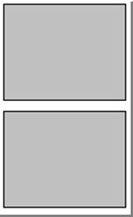
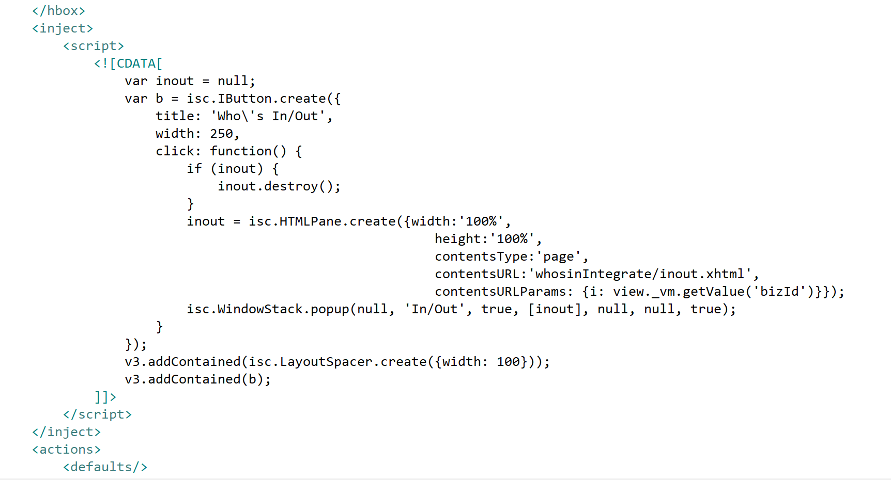
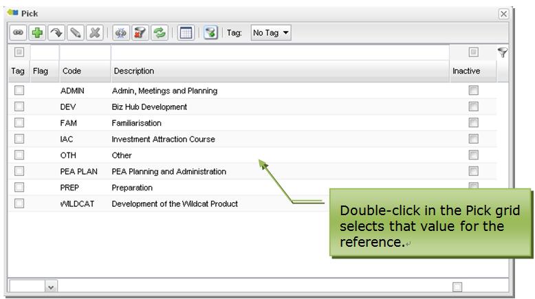
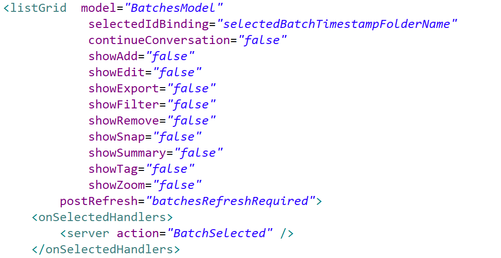
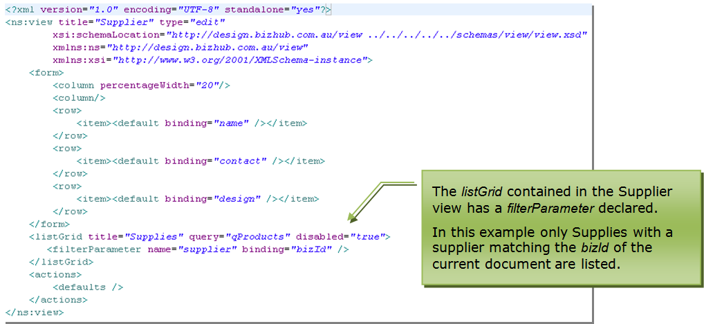

## Views

View declaration files override the default detail view (generated by
Skyve).

View files are located within the *views* folder in the document
package. Typically, users interact with a detail view after zooming into
the document from a list.

Two detail views can be declared for each document.

  View        | Description
  -----------|-----------
  edit.xml    | The basic view declaration for detail editing of a bean (normally accessed by zooming into a row from a list).<br><br>Menu items can also target edit views directly. In this case the menu item will trigger newInstance() and a new document instance will be returned (and therefore displayed). To show a singleton (a document instance which is the only applicable existing instance within the context), the newInstance() method can be overridden to select and return an existing bean in place of the newly created instance.<br><br>If a *create.xml* is supplied, the *edit.xml* file is only used after the document is created.
  create.xml  | A special case of edit view which is used if *create.xml* supplied and if *isCreated()* is false.

_View declaration_

### Containers

Containers are layout devices which contain other elements.

Containers share basic properties:

  Property          | Description
  ----------------- | ------------
  invisible         | Whether the container (and contents) are invisible to the user.<br><br>Invisibility may be set to *true*, *false* or the result of a declared condition.
  percentageHeight  | Percentage of the vertical visible area over which the container (and contents) will be stretched.
  percentageWidth   | Percentage of the horizontal visible area over which the container (and contents) will be stretched.
  pixelWidth        | Width of the container in pixels.
  pixelHeight       | Height of the container in pixels.

_Container properties_

#### Autofit Behaviour

Rendering behaviour is specific to browsers, however Skyve will attempt
to render the view as declared. Unless pixel sizes are specified, Skyve
will stretch view elements to cover the available window size, according
to the proportions and layout properties defined in the view.

Where the absolute size of the view exceeds the window space available,
the view will render with scroll bars. Containers may overflow if the
view definition doesn't adequately take account of the number and nature
of items contained.

Container | Description | Specific Properties | Example
----------|-------------|---------------------|----------
hbox | Elements are laid out horizontally in the view and may contain other containers. | <li>border - whether a border is displayed<li>borderTitle - the text to be displayed as a border title <li> pixelMemberPadding - padding (in pixels) between members <li>pixelPadding - padding (in pixels) around all members <li> | 
vbox | Elements are laid out vertically in the view and may contain other containers. | <li>border - whether a border is visible <li> borderTitle - the text to be displayed as a border title <li>pixelMemberPadding - padding (in pixels) between members <li>pixelPadding - padding (in pixels) around all members | 
tabPane, tab | A tab pane contains tabs. <br> Tabs may contain other containers. | <li>name - a logical way of referring to the tabPane <li>disabled - whether the tabPane is disabled <li>disabled (tab) - whether the tab is disabled. A disabled tab will display the tab header, but cannot be accessed. <li>title (tab) - the title of the tab <li>selected (tab) - whether the tab is opened by default when the view is accessed. Selected can be set to *true*, *false* or the result of a defined condition. | 

_View containers_

### Form

Forms contain columns and rows. Rows may only contain items.

Columns may be defined with or without *pixelWidth* or
*percentageWidth*. If no width type is displayed, the column will be
sized according to the impact of other elements of the view.
p*ercentageWidth* will size the column accordingly, provided this is
possible.

#### Form Example

```xml
<form>
  <column percentageWidth="20" />
  <column />
  <column />
  <row><item><textField binding="name" /></item></row>
  <row><item><textArea binding="description" wrap="true" /></item></row>
</form>
```

_Form declaration_

In the above example, 3 columns are declared. The two rows contain only
a single widget, however the textField and textArea widgets include
labels. These widgets therefore fill the two leftmost columns, leaving
the third column empty. Together the 3 columns stretch the width of the
entire available horizontal window space.

")

Most widgets span two columns - one for the widget label and one for the
actual widget itself. If the number of columns exceeds the number of
columns declared in the form, the row will overflow to another row. The
*spacer* widget is provided to allow position of widgets to odd columns
and for widgets with no label component.

Items within rows always fill from the leftmost available column. The
*spacer* widget is provided to allow items to fill from other than the
leftmost column.

If two unsized columns are defined, they will be stretched so that each
column will fill the available horizontal space. If one column is sized
and the other is not, the unsized column will stretch to fill the rest
of the available horizontal space.

***Tip:*** To allow the view to autofit and resize correctly, leave at
least one column unsized.

### Table

Deprecated. This feature is now met by using a disabled dataGrid.

### Item

  Property     | Description
  ------------ | ------------
  align        | Controls alignment of the item (left, right or centre).
  colspan      | The number of columns which the item spans.
  help 		   | tool-tip help text for the item
  label        | A label to be displayed irrespective of the type of widget the item contains.
  labelAlign   | Controls the alignment of the item label.
  required     | Whether the contained widget must have a value set before any actions can be completed.
  rowspan      | The number of rows which the item spans.
  showHelp     | Whether the contained widget will include a tool-tip help icon button, for a widget with an attribute which has a *shortDescription* defined.
  showLabel    | Whether the label of the contained widget will be displayed.

_Item properties_

### Widget

Skyve provides a number of view widgets, which can also be defined as
document attribute defaultWidget. When widgets contain labels, the label
will be displayed in bold type if the attribute is required.

  Widget | Description | Example
  ------ | ----------- | -------
  blurb              | displays the contained markup inside a _<div/>_ with binding substitutions<br/>Unlike other widgets, the blurb is not required to be contained within a _form_ container | 
  button             | can be placed within the view when the *inActionPanel* flag for an Action is set to *false*<br><br>If the Action is declared to be in the Action Panel, then no button widget is required to be declared.| 
  checkBox           | Tri-state check box | 
  colourPicker       | displays a text box containing the colour code value together with a sample square of the colour<br><br>Clicking on the sample square activates a colour selector popup. |  In this example, the colour button at the RHS will open a colour selector as shown below:<br> 
  combo              | drop-down selector for enumerations or where a domain type is specified for the document attribute | 
  contentImage       | displays the loaded image along with an upload action | 
  contentLink        | displays a hyperlink to open the content in a new browers window together with an upload action | 
  default            | If used in a view, this will render whatever the default widget is.<br><br>Either the *defaultWidget* declared on the document attribute or the Skyve default control for the attribute type.
  dialogButton       | Not yet implemented.
  geoLocator         | Geolocator will render a Map button, when pressed, a Geolocation window will appear with a pointer to the address or position bound to the Geolocator widget. <br> <br>A new address or location can be selected within the Geolocator Map if the Geolocator is not disabled.<br> <br>The Geolocator Widget has multiple bindings which interact with the map:<ul><li>addressBinding<li>cityBinding<li>stateBinding<li>postcodeBinding<li>countryBinding<li>latitudeBinding<li>longitudeBinding</ul> | In this example, the Map button is displayed. When clicked, the geolocator (shown below) will be displayed in a modal window. 
  geometry	         | displays a Well Known Text (WKT) representation of the geometry, with a map-based selection tool
  html | displays HTML content together with an Edit button <br><br> When the edit button is clicked, a popup HTML editor window is displayed allowing users to create rich HTML. | 
  inject | allows the inclusion of javascript snippets within the view |  
  label | Simple text. | 
  link | provides a _link_ style approach to Skyve platform features (partially implemented)<br/>options include <ul><li>actionReference - perform an action</li><li>contentReference - access a content item</li><li>defaultListViewReference - open a default list view</li><li>editViewReference - open an edit view for a binding</li><li>externalReference - a link to an external resource</li><li>implicitActionReference - perform a Skyve implicit action</li><li>queryListViewReference - open a list view based on a query</li><li>reportReference - perform a report action (view a report)</li><li>resourceReference - view a Skyve resource</li></ul> | 
  lookup | Deprecated. | 
  lookupDescription | *lookupDescription* is used to display an association to another document, and combines a combo with a pick button. <br><br> Users may select a value from the combo, or type values into the text box which will locate a matching value in the combo drop-down list if found. <br><br> When the pick button is pressed, a Pick window containing a listGrid is displayed, showing eligible values as declared in the document association. <br><br> Whereas normally double-clicking in a grid will zoom into the row, double-clicking in a Pick grid will select that value, close the popup and set the value of the *lookupDescription* combo next to the Pick button. <br><br> The down-arrow button reveals options to Edit (i.e. Zoom), New or Clear the reference. <br> More features of the *lookupDescription* are explained in the next section. |  <br> In this example the *bizKey* of the currently associated document instance is displayed in the control. To use another attribute change the lookupDescription's *descriptionBinding* attribute. <br> If the Pick button is clicked, a listGrid of eligible document instances is shown in a modal window. <br>  <br> The down-arrow selector button will display options for Edit (edit the referenced document on-the-fly), New (create a new potential reference on-the-fly) and Clear (clear the reference). <br> 
  password | a textField which obfuscates the entered value | 
  progressBar | Not yet implemented.|
  radio | radio selector for enumerations or for document attributes where a domain type is specified <br> <br> Radios may be laid out vertically or horizontally, using the property *vertical*. |  <br> Vertical arrangement is the default arrangement for radio selectors when no arrangement is specified.
  richText | provides a rich text area together with formatting toolbar |                  
  slider | Numeric slider. <br><br> Properties include: <br> <li> min <li> max <li> numberOfDiscreteValues <li> roundingPrecision <br> May be displayed vertically when *vertical* is set to *true*. |    
  spacer | a widget provided to fill a column when no other widget is required <br><br> Items within rows always fill from the leftmost available column. The spacer widget is provided to allow items to fill from other than the leftmost column.| The spacer widget displays nothing.
  spinner | numeric spinner allowing users to either type or select a value using the arrows <br><br>Properties include:<li>min<li>max<li>step - the amount to increment/decrement for each arrow button press | 
  staticImage | displays a static image |  
  staticLink | hyperlink to a static URL<br><br>Properties:<li>ref - the URL<li>value - the value displayed in the link, this defaults to the URL if not supplied.<li>newWindow - whether the target will be displayed in a new window|  Not yet implemented.
  textArea | basic data entry field for long text<br><br>textArea provides a *wrap* property to control whether the contained text is word wrapped. |
  textField | provides basic data entry for text attributes <br><br> *textField* responds to the type of the bound attribute, and will display converter hint if the value is null.<br><br>For *date* and *dateTime* types, a calendar selector is displayed.|  <br> This example is a *textField* widget bound to a text type attribute. <br>  <br> This example is a *textField* widget bound to a time attribute using the *HH\_MM* converter. <br>  <br> This example is a *textField* widget bound to a *date* or *dateTime* attribute. The calendar tool on the right will either include time or not depending on which of these types the attribute is.

### OnChange Event Action (Client-side Events)

*OnChange* event actions can be defined for the change of value of
widgets defined within a view.

  Event Action    | Description
  --------------- | -----------
  rerender        | hits the server, reevaluates the UI conditions, but maintains user edits.
  server          | executes a server-side action.
  setDisabled     | sets the widget to disabled based on a condition (SmartClient renderer only)
  toggleDisabled  | checks the state of the widget pointed to by the binding and toggles the disabled state. (SmartClient renderer only)
  setInvisible    | sets the widget to invisible based on a condition. (SmartClient renderer only)
  toggleInvisible | checks the state of the widget pointed to by the binding and toggles the disabled state. (SmartClient renderer only)

_OnChange Event Actions_

Multiple event actions can be defined for the single event, and the
order of execution will follow the order in which the handlers are
declared.

```xml
<combo binding="treatmentType">
  <onChangeHandlers>
    <server action="recalculate" />
    <setDisabled disabled="zeroValue" />
    <rerender />
  </onChangeHandlers>
</combo>
```

_Example of multiple onChangeHandlers_

#### Update property

The update property (PrimeFaces renderer only) implements the PrimeFaces update property - which allows developers to 
limit rerendering to a specified container.


In the above example, only the container with a widgetId of 'citizenship' will be rerendered when the value of the _combo_ is changed.

### The lookupDescription Widget in Detail

The *lookupDescription* widget is unique to Skyve and provides
comprehensive ability to display and select document references.

  Property            | Description
  ------------------- | ---------------------
  binding             | The association attribute to which the widget is bound.
  descriptionBinding  | The binding in the associated document which will be displayed in the text box when an reference is selected. In most cases, the *descriptionBinding* will be set to the *bizKey* attribute of the reference, which defines a short text representation of the entire document being referenced.<br><br>*bizKey* is always available for query based widgets and does not need to be declared as a column within the query definition.
  disabled            | Controls whether all aspects of the widget are disabled.
  disableAdd          | Controls whether the Add function (New) is disabled (allowing on-the-fly creation of the foreign reference).
  disableClear        | Controls whether the Clear function is disable (clearing the reference).
  disableEdit         | Controls whether the Edit function is disabled (allowing on-the-fly editing of the foreign reference).
  disablePick         | Controls whether the Pick list is accessible.
  invisible           | Controls whether the entire widget is invisible.
  pixelWidth          | Width of the text box component in pixels.
  query               | By default, a *lookupDescription* will use the *defaultQuery* for the document specified in the association attribute declaration for both the combo/drop-down and pick list. If the association nominates a metadata query then this query will be used. If the widget nominates a query in this attribute, this query will be used.<br><br>Note that *bizKey* is always available for queries and does not need to be declared as a column in the query.

_Properties of the lookupDescription_


#### Multi-column Drop-down/Combo lookupDescription

By default the *lookupDescription* will display only the *bizKey* for
each row returned by the effective query in the drop-down. However,
*lookupDescription* can alternatively nominate a subset of query columns
for display in the drop-down.

```xml
<lookupDescription binding="bankAccount" descriptionBinding="bizKey" query="docQueryBankAccount" >
    <filterParameter operator="equal" name="active" value="true"/>
    <dropDown>
        <column>bsb.bsb</column>
        <column>accountNumber</column>
    </dropDown>
</lookupDescription>
```

_Multi-column drop-down lookupDescription_

#### Filter parameters for lookupDescription

Filter parameters can be applied to the *lookupDescription* widget,
which will apply additional filtering (over and above any filtering
defined in the applicable query). Filter parameters can be value (for a
static value) or binding (filtering the list of eligible references by
the value of a binding from the document being viewed).

```xml
<lookupDescription binding="contact" descriptionBinding="bizKey" disabled="notManager">
  <filterParameter name="contactType" value="Person" />
</lookupDescription>
```

_Filter parameters for lookupDescription_

If *filterParameters* have been defined and the user creates a reference
on-the-fly (using the *Add*/*New* action), the created document will
have the *filterParameter* values set by default.

```xml
<row>
  <item>
    <lookupDescription binding="codeListAllocationCode" descriptionBinding="bizKey">
      <filterParameter name="codeListSchemeCode" binding="parent.codeListSchemeRound.codeListSchemeCode" />
    </lookupDescription>
  </item>
</row>
```
_Example lookupDescription with filterParameter_

In the above example, the *lookupDescription* for binding
*codeListAllocationCode* has a *filterParameter* using the current
document binding of *parent.codeListSchemeRound.codeListSchemeCode* used
as the filtering value on the column named *codeListSchemeCode* in the
related data set or query (using the name of the reference implies the
use of the *bizId* field).

If the user opts to create a new *codeListAllocationCode* reference,
then the attribute called *codeListSchemeCode* in the new
*codeListAllocationCode* instance will be set to the value of
*parent.codeListSchemeRound.codeListSchemeCode.*

Note that any number of *filterParameters* can be declared.

#### OnChange Handlers for lookupDescription

Rather than a generic *OnChange* action event, the *lookupDescription*
provides the ability to define actions for each type of event which the
widget supports.

The available event handlers are:

-   *onAddedHandlers*,
-   *onClearedHandlers*,
-   *onEditedHandlers*, and
-   *onPickedHandlers*.

```xml
<lookupDescription binding="contact" descriptionBinding="bizKey" disabled="notManager">
  <onAddedHandlers>
    <server action="applyRules" />
  </onAddedHandlers>
  <filterParameter name="contactType" value="Person" />
</lookupDescription>
```

_The onAddedHandler event action_

In the above example, if the user sets a reference by creating a
document on-the-fly, the server-side action *applyRules* will be
executed after the Add action is completed.

The action events available are the same as for all other event actions
as described in Table 14. As with all *OnChanged* handlers, multiple
event actions can be executed for the same event.

### dataGrid

A *dataGrid* displays members of a collection.

The *dataGrid* widget has the following properties.

  Property                          | Description
  --------------------------------- | --------------------------------
  binding                           | the collection to which the grid is bound
  disabled                          | an overall control disabling all aspects of the grid<br><br>This setting overrides all other settings if *disabled* = true.
  disableAdd                        | disables the ability to add members to the collection (add button and context Add are disabled)
  disableEdit                       | disables the ability to edit within the grid (edit button and context Edit)
  disableRemove                     | disables the ability to remove members from the collection (remove button and context Remove are disabled)
  disableZoom                       | disables the ability to zoom into the member
  editable                          | removes all access to the grid toolbar
  enableAdd                         | enables the ability to add members to the collection (add button and context Add are disabled)
  enableEdit                        | enables the ability to edit within the grid (edit button and context Edit)
  enableRemove                      | enables the ability to remove members from the collection (remove button and context Remove are disabled)
  enableZoom                        | enables the ability to zoom into the member
  inline                            | allows editing of the grid row in-line rather than by zooming into the member's edit view
  invisible                         | hides the grid
  maxPixelHeight, maxPixelWidth, minPixelHeight, minPixelWidth    | control the maximum and minimum height and width of the grid in pixels
  percentageHeight, percentageWidth | height and Width in terms of percentage of available space
  pixelHeight, pixelWidth           | height and Width in terms of pixels
  responsiveWidth                   | control the width of the grid using the responsive layout concept
  selectedIdBinding                 | if a selectedIdBinding is provided, the attribute will hold the Id of the selected row - this enables user interactions based on which row is selected
  showAdd                           | show or hide the Add (i.e. new child row) control 
  showDeselect                      | show or hide the Deselect row control
  showEdit                          | show or hide the Edit contol (for inline row editing)
  showRemove                        | show or hide the Remove control (for removing a child row) 
  showZoom                          | show or hide the Zoom control
  title                             | the title of the grid
  visible                           | whether to show or hide the grid
  widgetId                          | an identifier for the grid  - a way to uniquely identify the grid component
  wrap                              | default setting for contained widgets which controls whether the display of text should wrap (expanding row sizes) or whether text should truncate (so that only text which fits in the column width is displayed)

_dataGrid properties_

By default, the *dataGrid* widget displays with an action tool bar
relevant for managing the collection. *datagrids* support drag-drop for
ordering, provided this is allowed as per the declaration of the
collection.


#### Columns

Grid columns are bound to attributes of the collection member document -
the document specified in the declaration of the collection. If no input
widget is declared the column will use the default widget for the
attribute, or the default widget for the attribute type.

dataGrid provides two types of columns containers: 
* boundColumn
* containerColumn

A boundColumn is a column for a binding and the boundColumn properties include:

  Property      | Description
  ------------- | -----------------------------------------------
  alignment     | whether the column is aligned _left_, _centre_ or _right_
  binding       | document attribute to which the column is bound
  editable      | controls whether the attribute is editable within the *dataGrid*
  pixelWidth    | width of the column in pixels
  title         | a column title to use instead of the attribute's *displayName*

_dataGrid boundColumn properties_

A containerColumn provides more control over the widget type contained in the column and properties include:

  Property      | Description
  ------------- | -----------------------------------------------
  alignment     | whether the column is aligned _left_, _centre_ or _right_
  pixelWidth    | width of the column in pixels
  title         | a column title to use instead of the attribute's *displayName*

_dataGrid containerColumn properties_

A containerColumn can contain the following widgets:
* blurb
* contentImage
* dynamicImage
* label
* link
* staticImage

The widget declared in the containerColumn controls the 
input widget when the value is edited, in preference to the default
widget.

#### Event handlers for dataGrid

The dataGrid widget offers the following event handlers:
* onAddedHandler - what events to perform after a new row is added to the grid
* onEditedHandler - what events to perform after a row is edited
* onRemovedHandler - what events to perform after a row is removed/deleted
* onSelectedHandler - what events to perform after a row is selected


### listGrid

Views may also contain an embedded *listGrid* which is identical to the
main list feature. 

A *listGrid* can be used for showing collections of
document instances and can be used to show loosely defined relationships, for example, if the Contact view was required
to include a list of other Contacts with the same Post Code (even though
no formal relationship to a Post Code document is implemented).



  Property      | Description
  ------------- | -----------------------------------------------
  autoPopulate                       | whether or not the list results will be populated as soon as the list is due to be rendered - if autoPopulate is set to "false", the list will not populate results until filter criteria have been provided and the filter control is actioned
  disableAdd                         | disables the ability to add members to the collection (i.e. the *Add* button and context menu item *Add* are disabled)
  disabled                           | an overall control disabling all aspects of the grid
  disableEdit                        | disables the ability to edit within the grid (i.e. the *Edit* button and context menu item *Edit*)
  disableRemove                      | disables the ability to remove members from the collection (i.e. the *Remove* button and context menu item Remove are disabled)
  disableZoom                        | disables the ability to zoom into the member
  continueConversation               | whether events occurring within the scope of the listGrid activity are to be handled within the same transaction as events on the bean on which the view, containing the listGrid, is based
  enableAdd                          | enables the ability to add members to the collection (i.e. the *Add* button and context menu item *Add* are enabled)
  enabled                            | an overall control enabling all aspects of the grid
  enableEdit                         | enables the ability to edit within the grid (i.e. the *Edit* button and context menu item *Edit*)
  enableRemove                       | enables the ability to remove members from the collection (i.e. the *Remove* button and context menu item Remove are enabled)
  enableZoom                         | enables the ability to zoom into the member
  invisible                          | hides the grid
  maxPixelHeight, maxPixelWidth, minPixelHeight, minPixelWidth | the maximum and minimum height and width of the list in pixels
  model                              | the list model on which the rows of the list are populated
  percentageHeight, percentageWidth  | height and width in terms of percentage of available space
  pixelHeight, pixelWidth            | height and width in terms of pixels
  postRefresh                        | whether the list is automatically repopulated after the rerender event
  query                              | the query defining the results displayed in the grid. Unlike *lookupDescriptions*, which can use default  document queries, *listGrid* must have a query nominated (and therefore declared in the *module.xml*)
  responsiveWidth                    | the width of the list according the responsive layout concept
  selectedIdBinding                  | if a selectedIdBinding is provided, the attribute will hold the Id of the selected row - this enables user interactions based on which row is selected
  showAdd                            | whether to show or hide the Add (new instance) control
  showDeselect                       | whether to show or hide the Deselect row control 
  showEdit                           | whether to show or hide the Edit control 
  showExport                         | whether to show or hide the Export control
  showFilter                         | whether to show or hide the Filter controls (both simple and advanced filter controls)
  showRemove                         | whether to show or hide the Remove (row delete) control
  showSnap                           | whether to show or hide the Snapshot control 
  showSummary                        | whether to show or hide the Summary control 
  showTag                            | whether to show or hide the Tag control 
  showZoom                           | whether to show or hide the Zoom (zoom into a row) control
  title                              | the title of the *listGrid* (displayed above the *listGrid*)
  visible                            | whether or not the listGrid is visible

_listGrid properties_

Where a *query* is declared, the ability to edit individual column values will be as declared by the
query unless the grid is disabled or editing is disabled using the
*disableEdit* property.

Where *continueConversation* is set to "false", *listGrid* events will not be managed within the same transaction as other
events in the view.

For example, if a user zooms into a row of a *listGrid* the edit view
zoomed to will display *OK* and *Save* actions by default (unless the
edit view declares otherwise). Changes to the zoomed to document will be
in a separate transaction to any activity on the document in the view
where the *listGrid* is located.

Where a *model* is declared, population of list rows is handled by the *model* code. 
List models support paging, summaries and filtering
, where filter controls can manipulate predicates to impact on the list results.

#### Filter Parameters for listGrid

Filter parameters can be applied to the *listGrid* widget which will
apply additional filtering (over and above any filtering defined in the
applicable query).

Filter parameters can be *value* (for a static value) or *binding*
(filtering the list of eligible references by the value of a binding
from the document being viewed).

If *filterParameters* have been defined and the user creates a new
document from the grid (using the grid *Add* action), the created
document will have the *filterParameter* values set by default.



In the example shown above, the *filterParameter* name 'supplier'
corresponds to the binding of the 'qProducts' query column being
filtered. The *filterParameter* binding 'bizId' refers to the binding in
the current document view which provides the value for the filter (in
this case *bizId*). Note that the binding does not need to be included
in the view declaration to be able to be used for a *filterParameter*.

In the example above, the effect of filtering by binding bizId is that
the listGrid will only display products from the *qProducts* query where
the supplier column matches the supplier displayed in the view.

#### Event handlers for listGrid

The listGrid widget offers the following event handlers:
* onDeletedHandler - what events to perform after a row is deleted
* onEditedHandler - what events to perform after a row is edited
* onSelectedHandler - what events to perform after a row is selected

### New Parameter

The *newParameter* section enables the context of one view to be passed
to another view, when new documents are being created.

For example, if a view contains a *listGrid* which is filtered for
Contacts of type *Person* and the user adds a row to the *listGrid* in
that context, the fact that this new row implicitly belongs to a
filtered set needs to be passed, and so the *Person* type value should
be set by default in the new Contact. (It would be unexpected for
example, to add a new row to a list of *Person* type Contacts which is
not a *Person* type Contact.)

For parameters to be passed in this way, the *newParameters* named in
the target view must match the names of the *filterParameters* being
passed.

The name of each *newParameter* in the target view matches a binding in
the document of the target view. The binding does not need to be present
in the target view definition, but it must be a valid binding in the
target document.

```xml
<newParameters>
  <parameter name="model" />
  <parameter name="type" />
</newParameters>
```

_newParameters section_

### Action declaration

The action section of the view declares which actions will be available
to the user and under what conditions.

Skyve will automatically hide actions which are declared in the view, but are no appropriate for the user or sitauation (for example, if the *new* action is declared, 
but a user's privileges do not include the _create_ privelege for the relevant document).

Typically, scaffolded views contain the _<defaults/>_ action which represents the group of actions Skyve deems to be valid in the specific context given the user's privileges. Alternatively, default actions can be declared individually (e.g. *OK*,
*Save*, *Cancel* etc.).

Note that actions can be located either in the *ActionPanel* or using the _<button/>_ widget within a view _form_, however the action is declared
in the _<actions/>_ section, whether or not the action
button will be displayed in the *ActionPanel* or elsewhere .

*Report* actions (described below) provide access to defined report
objects (for example Jasper reports) and must also be declared in the actions section of the view.


***Tip:*** You must declare all actions in the action section even if
they will not appear in the ActionPanel.

  Property      | Description
  ------------- | -----------
  className     | the name of the Java action class to be executed when the button is pressed
  clientValidation | whether or not to perform validation in the client, prior to (i.e. to determine whether) the action should be allowed to be performed - if clientValidation is set to "false" the the action will be permitted whether "required" or other validation types may not yet be met
  confirm       | a confirmation message to be displayed requesting confirmation by the user<br><br>If no confirmation message is supplied, no confirmation is requested.
  disabled      | whether the button is shown in a disabled state
  displayName   | the text which will appear on the button
  inActionPanel | controls whether the action button is included in the Action Panel at the top of the view <br><br>If a button is not to be displayed in the *ActionPanel* a button widget will be required elsewhere within the view for the action to be accessible.
  iconStyleClass | the icon class to use as the icon for the action using the fontawesom icon style classes - note that special action types (_ok_, _save_, _delete_, _cancel_, zoomOut_, remove_, _download_, _upload_, _import_, _export_) have predetermined icons - e.g. "fa fa-file-photo-o" will use the fontawesome ("fa") style class "fa-file-photo-o"
  invisible     | whether the action button is invisible
  relativeIconFileName | the filename of an icon which will be displayed together with the *displayName* on the button<br><br>        Filenames are usually relative allowing the Skyve overriding mechanism to locate the absolute path to the file based on the context of the user.
  name          | where multiple actions may refer to the same action but with different options, the name property distinguishes which property set declaration to use (for example, to send different parameters to the same report)
  toolTip       | tooltip help to be displayed for the button
  visible       | whether the action button is visible

_View declaration Action properties_


The example declaration in the above example declares default actions
using the *&lt;defaults&gt;* action set and the *&lt;cancel&gt;* action,
using mutually exclusive conditions. Numerous *Custom* actions are
declared as well as a report action.

For more details see [Actions](./../_pages/actions.md "Actions").

### Declaring report actions

*Report* actions declared in a view must reference valid reports
(*\*.jrxml* files) and are a special case of actions.

*Report* actions declarations can include parameters passed to the
report engine (see the above example).

Report parameter declarations can be in terms of bindings (within the
currently viewed document) or static values. Report parameters are
matched using the name attribute with parameters declared in the report.

```xml
<report reportName="PaySheet" moduleName="time" documentName="PaySheet" displayName="Print PaySheet" visible="saved">
	<parameter name="ID" binding="bizId" />
</report>
```		

In addition to the generic action properties, *Report* actions must
include a *moduleName* and *documentName* attributes to specify the location of the report
template file relative to the *module.document* package.

Report actions are not declared within role definitions in the
*module.xml*.


**[⬆ back to top](#contents)**

---
**Next [Actions](./../_pages/actions.md)**  
**Previous [Bizlets](./../_pages/bizlets.md)**
