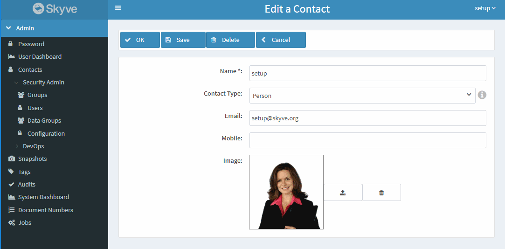

## Working with content

### Content attachments and images

Skyve includes both structured database persistence and a non-sql/content repository for the storage of file attachments, images and other non-structured data.

Skyve integrates the two persistence mechanisms transparently for developers and users for no-code and low-code applications. Additionally, Skyve provides a platform independent and consolidated backup and restore capability for both stores. However, developers can take advantage of understanding the distinction between the two types of persistence to produce sophisticated and rich solutions. 

Skyve incorporates the Elastic content repository for non-sql storage. Elastic requires access to the file system and a `content` folder must be specified in the application `.json` settings file for the Skyve platform to be able to start, with read and write permissions being assigned to the user credential under which Wildfly runs.

(For the developer environment, we recommend selecting a folder location for content which is outside of the project, to avoid problems with IDEs like Eclipse constantly scanning the folder for changes.)

#### Using content

Skyve manages content by linking the stored item with the bean context in which it exist - namely, in a `<content>` type document attribute.

For example, the document `Contact` may have the following attributes:
Attribute | Type | Description
----------|------| -----
name | text, 200 | the name of the person or organisation
contactType | enumeration | whether the contact is a person or an organisation
email1 | text, 500 | the email address for the contact
mobile | text, 20 | the mobile or cell number for the contact
image | content | the photo of the person or organisation logo

For the above example, in the view for a contact, Skyve will provide a content widget (with _upload_ and _clear_ buttons assuming the widget is not disabled), as shown: 



When the user uploads the image, the image item (in this case a `.png` file) will be stored in the content repository and an identifier (which links to the repository) will be stored in the database tuple for the content, as shown:


When Skyve retrieves or saves a bean (for example for display in the view), Skyve automatically maintains the content `id` value appropriately for the bean to ensure the integrity of the context. 

#### Retrieving content items in code

Using the `getter` in code for the `content` attribute will return only the `id` of the content as a `String`, and not the content item itself. To retrieve the content item, Skyve provides `Ext.newContentManager()`.

In the example of the Contact document above, the following code retrieves a byte array `byte[]` for the content item, and constructs a link to the item

```java
try (ContentManager cm = EXT.newContentManager()) {
      AttachmentContent ac = cm.get(bean.getImage());
      byte[] fileBytes = ac.getContentBytes();
      
	  if (ac != null) { 
		String link = String.format("<a href=\"%s/content?_n=%s&_doc=%s.%s&_b=%s" + 
						"\" target=\"_content\">%s (%s)</a>",
						Util.getSkyveContextUrl(),
						bean.getImage(),
						ac.getBizModule(),
						ac.getBizDocument(),
						ac.getAttributeName(),
						ac.getFileName(),
						ac.getMimeType());
	}      
}
```

#### The content servlet

Skyve provides a content servlet for returning content from a link constructed along the lines of the example above.

The content servlet is accessible from the Skyve context url `/content` and will retrieve the content item specified by the given parameters.

If the content servlet request is provided with height and width parameter values, Skyve will return either an image of the specified size (if the content item is a recognised image type), or an icon representing the MimeType of the content item.

To include a content item image in a documentQuery column (for example in a list grid), construct a column similar to the following example:

```xml
<column displayName="Image" editable="false" filterable="false" sortable="false" alignment="centre" pixelWidth="70">
	<name>image</name>
	<expression>
		<![CDATA[
		 	concat(concat('')
		]]>
	</expression>
</column>
```

#### Content column type

Skyve provides a `content` column type with display options of `link` or `thumbnail` for exactly this purpose, for example:

```xml
<query name="qContact" documentName="Contact">
	<description>All Contact Details</description>
	<columns>
		<content display="thumbnail" binding="image"/>
		<column binding="name" sortOrder="ascending" />
		<column binding="contactType" sortOrder="ascending" />
		<column binding="email1" sortOrder="ascending" />
		<column binding="mobile" sortOrder="ascending" />
	</columns>
</query>
```

 
 
Using the `thumbnail` display option, where the content item is not an image, Skyve will return a thumbnail file type icon.


The `content` column type using display option `link` will provide a download link for the item.
 
#### Content storage

_NOTE_ the following information is provided for information only - manipulating the content storage area directly may result in loss of data. 

When Skyve starts, the platform will create (if it doesn't already exist) a folder (within the specified `content` folder) called `SKYVE_CONTENT`. As content items are saved in a Skyve application, the platform will save these in a folder (within the specified `content` folder) called `SKYVE_STORE`.

The `SKYVE_STORE` folder contains the content items (file attachments, images etc) in their original format and with associated metadata saved in a co-located file called `meta.json` as shown. 


The associated `meta.json` includes the identity of the bean context in which the content exists as well as the original file name, format and last modification datetime.

```json
{"attribute":"contentItem","bizCustomer":"cit","bizDataGroupId":null,"bizDocument":"ContentContainer","bizId":"97685d51-2746-426b-949c-0754509d7438","bizModule":"myModule","bizUserId":"6568db1f-be43-444b-a62a-b4468cabba0b","content_type":"application\/pdf","filename":"Skyve Developer Guide.pdf","last_modified":"2018-11-30T03:28:51.773+00:00"}
```


**[⬆ back to top](#working-with-content)**

---
**Next [Skyve Persistence Mechanisms](./../_pages/skyve-persistence-mechanisms.md)**  
**Previous [Common patterns](./../_pages/common-patterns.md)**
